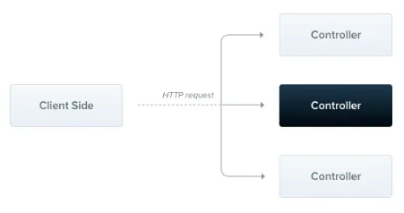

# Controllers

> **컨트롤러는 수신 요청을 처리하고 클라이언트에 응답을 다시 보내는 일을 담당함**
>



<br>

컨트롤러의 목적

- **애플리케이션에 대한 특정 요청을 처리하는 것**
- 라우팅 메커니즘에 따라 각 요청을 처리할 컨트롤러가 결정됨
- 컨트롤러에는 여러 개의 경로가 있는 경우가 많으며 각 경로는 서로 다른 작업을 수행할 수 있음

<br>

기본 컨트롤러를 만들기 위해 클래스와 데코레이터를 사용함

- 데코레이터는 클래스를 필요한 메타데이터와 연결하여 Nest가 요청을 해당 컨트롤러에 연결하는 라우팅 맵을 생성할 수 있도록 함

<br>

## 라우팅


**다음 예제는 기본 컨트롤러를 정의하는 데 필요한 `@Controller()` 데코레이터를 사용함**

- 경로는 cats로 지정을 함
- @Controller() 데코레이터에 경로 접두사를 사용하면 관련 경로를 함께 그룹화하고 반복되는 코드를 줄일 수 있음.
    - ex. 고양이 엔티티와의 상호작용을 관리하는 경로를 /cats 경로 아래에 그룹화 하는 경우
    - → @Controller() 데코레이터에 cats를 접두사로 지정할 수 있음

`cats.controller.ts`

```tsx
import { Controller, Get } from '@nestjs/common';

@Controller('cats')
export class CatsController {
  @Get()
  findAll(): string {
    return 'This action returns all cats';
  }
}
```

**→ 이 엔드포인트로 GET 요청이 이루어지면 Nest는 요청을 사용자 정의된 findAll() 메서드로 라우팅함**

→ 이 메서드는 200 상태 코드를 반환하며, 문자열이 반환됨.

만약 컨트롤러 접두사가 cats이고 메서드 데코레이터가 `@Get(’breed’)`인 경우 결과 경로는

→ **`GET /cats/breed`** 가 됨

<br>

## 요청 객체


핸들러는 종종 클라이언트의 요청 세부 정보에 액세스해야 함.

Nest는 기본 플랫폼(Express)에서 요청 객체에 대한 액세스를 제공함.

- 핸들러의 서명에 `@Req()` 데코레이터를 사용하여 요청 객체를 삽입하도록 Nest에서 지시하여 요청 객체에 액세스 할 수 있음

`cats.controller.ts`

```tsx
import { Controller, Get, Req } from '@nestjs/common';
import { Request } from 'express';

@Controller('cats')
export class CatsController {
  @Get()
  findAll(@Req() request: Request): string {
    return 'This action returns all cats';
  }
}
```

<br>

**요청 객체는 HTTP 요청을 나타내며 query string, 매개변수, HTTP headers 및 body에 대한 속성을 포함함.**

- 대부분의 경우 이러한 속성은 수동으로 액세스할 필요가 없음
- `@Body()` 또는 `@Query()`와 같은 전용 데코레이터를 사용할 수 있음.

<br>

| `@Request(), @Req()` | `req` |
| --- | --- |
| `@Response(), @Res()`***** | `res` |
| `@Next()` | `next` |
| `@Session()` | `req.session` |
| `@Param(key?: string)` | `req.params` / `req.params[key]` |
| `@Body(key?: string)` | `req.body` / `req.body[key]` |
| `@Query(key?: string)` | `req.query` / `req.query[key]` |
| `@Headers(name?: string)` | `req.headers` / `req.headers[name]` |
| `@Ip()` | `req.ip` |
| `@HostParam()` | `req.hosts` |

<br>

## 리소스(Resources)


앞서 고양이 리소스를 가져오는 엔드포인트(GET)를 정의함. 일반적으로 새 레코드를 생성하는 엔드포인트도 제공해야 함.

→ 이를 위해 POST 핸들러는 만들어보자

`cats.controller.ts`

```tsx
import { Controller, Get, Post } from '@nestjs/common';

@Controller('cats')
export class CatsController {
  @Post()
  create(): string {
    return 'This action adds a new cat';
  }

  @Get()
  findAll(): string {
    return 'This action returns all cats';
  }
}
```

<br>

Nest는 모든 표준 HTTP 메서드에 대한 데코레이터를 제공함

- @Get()
- @Post()
- @Put()
- @Delete()
- @Patch()
- @Options()
- @Head()
- @All() : 모든 메서드를 처리하는 엔드포인트

<br>

## Route wildcards


Nest에서는 패턴 기반 경로도 지원됨.

ex. “*” 를 와일드카드로 사용하여 경로 끝에 있는 경로의 모든 문자 조합을 일치시킬 수 있음.


<br>

다음 예제는 뒤에 오는 문자수에 관계없이 abcd/로 시작하는 모든 경로에 대해 findAll() 메서드가 실행됨

```tsx
@Get('abcd/*')
findAll() {
  return 'This route uses a wildcard';
}
```

→ 이는 abcd/, abcd/123, abcd/abc 등의 모든 경로를 포함시킬 수 있는 것

<br>

이 접근 방식은 Express와 Fastify 모두에서 작동함.

<br>

## Status code


**응답의 기본 상태 코드는 기본값이 201인 POST 요청을 제외하고는 항상 200임**

핸들러 수준에서 @HttpCode() 데코레이터를 사용하여 이 동작을 쉽게 변경할 수 있음

```tsx
@Post()
**@HttpCode(204)**
create() {
  return 'This action adds a new cat';
}
```

<br>

## Response headers


**사용자 지정 응답 헤더를 지정하려면 @Header() 데코레이터 또는 라이브러리별 응답 객체를 사용하거나 res.header()를 직접 호출하면 됨**

```tsx
@Post()
@Header('Cache-Control', 'no-store')
create() {
  return 'This action adds a new cat';
}
```

<br>

## Redirection


**응답을 특정 URL로 리다이렉션 하려면 @Redirect() 데코레이터 또는 라이브러리별 응답 객체를 사용하거나 res.redirect()를 직접 호출할 수 있음**

- 두 개의 인자를 받음
    - url
    - statusCode
- statusCode의 기본값은 생략할 경우 302(Found)임

```tsx
@Get()
@Redirect('https://nestjs.com', 301)
```

<br>

## Route parameters


정적 경로를 사용하는 경로는 요청의 일부로 동적 데이터를 받아들어야 하는 경우 작동하지 않음…

ex. ID가 1인 고양이를 가져오려면 GET /cats/1

<br>

**매개변수가 있는 경로를 정의하려면 경로에 매개변수 토큰을 추가하여 URL에서 동적 값을 가져올 수 있음.**

그런 다음 메서드 서명에 추가해야 하는 @Param() 데코레이터를 사용하여 이러한 경로 매개변수를 액세스 할 수 있음

`cats.controller.ts`

```tsx
@Get(':id')
findOne(@Param() params: any): string {
  console.log(params.id);
  return `This action returns a #${params.id} cat`;
}
```

→ params.id를 참조하여 id 매개변수에 액세스할 수 있음

<br>

또한 특정 매개변수 토큰을 데코레이터에 전달하고 메서드 본문내에서 이름으로 경로 매개변수를 직접 참조할 수 있음

`cats.controller.ts`

```tsx
@Get(':id')
findOne(@Param('id') id: string): string {
  return `This action returns a #${id} cat`;
}
```

<br>

## 비동기성(Asynchronicity)


Nest는 비동기 함수를 완벽하게 지원함.

**모든 비동기 함수를 반드시 Promise를 반환해야 하며, 이를 통해 Nest가 자동으로 확인할 수 있는 지연된 값을 반환할 수 있음**

`cats.controller.ts`

```tsx
@Get()
async findAll(): Promise<any[]> {
  return [];
}
```

<br>

## Request payloads


이전 예제는 POST 라우트 랜들러가 클라이언트 매개변수를 받아들이지 않음. Body() 데코레이터를 추가해 이 문제를 해결해 보자.

<br>

DTO 스키마 정의

`create-cat.dto.ts`

```tsx
export class CreateCatDto {
  name: string;
  age: number;
  breed: string;
}
```

<br>

의문점: 여기서 class를 사용하는 이유는??

**→ 클래스는 JS ES6 표준의 일부이기에 컴파일된 JS에서 실제 엔티티로 그대로 유지되기 때문**

→ 반면 TS의 인터페이스는 컴파일중에 제거되기 때문에 Nest는 이를 런타임에 참조할 수 없음…

<br>

`cats.controller.ts`

```tsx
@Post()
async create(@Body() createCatDto: CreateCatDto) {
  return 'This action adds a new cat';
}
```

<br>

## Query parameters


**라우트에서 쿼리 매개변수를 처리할 때 @Query()  데코레이터를 사용하여 수신 요청에서 해당 매개변수를 추출할 수 있음**

ex. 나이와 품종과 같은 쿼리 매개변수를 기반으로 고양이 목록을 필터링

CatsController에서 쿼리 매개변수를 정의함

```tsx
@Get()
async findAll(@Query('age') age: number, @Query('breed') breed: string) {
  return `This action returns all cats filtered by age: ${age} and breed: ${breed}`;
}
```

<br>

이 예의 query string은 다음과 같음

```tsx
GET /cats?age=2&breed=Persian
```

→ 나이는 2, 품종은 페르시안이 됨

<br>

## Full resource sample


기본 컨트롤러를 만드는 방법을 보여주는 예제

`cats.controller.ts`

```tsx
import {
    Controller,
    Get,
    Query,
    Post,
    Body,
    Put,
    Param,
    Delete,
} from "@nestjs/common";
import {
    CreateCatDto,
    UpdateCatDto,
} from "./dto/cat.dto";

@Controller("cats")
export class CatsController {
    @Post()
    create(@Body() createCatDto: CreateCatDto) {
        return "This action adds a new cat";
    }

    @Get()
    findAll(@Query() query: any) {
        return `This action returns all cats (limit: ${query.limit} items)`;
    }

    @Get(":id")
    findOne(@Param("id") id: string) {
        return `This action returns a #${id} cat`;
    }

    @Put(":id")
    update(@Param("id") id: string, @Body() updateCatDto: UpdateCatDto) {
        return `This action updates a #${id} cat`;
    }

    @Delete(":id")
    remove(@Param("id") id: string) {
        return `This action removes a #${id} cat`;
    }
}
```

<br>

## 시작 및 실행하기


CatsContorller가 완전히 정의도어 있어도 Nest는 아직 이를 알지 못하며 클래스의 인스턴스를 자동으로 생성하지 않음.

<br>

컨트롤러는 항상 모듈의 일부여야 하기에 @Module() 데코레이터 안에 컨트롤러 배열을 포함시킴.

`app.module.ts`

```tsx
import {Module}         from "@nestjs/common";
import {CatsController} from "./cats/cats.controller";

@Module({
    imports: [],
    controllers: [CatsController],
    providers: [],
})
export class AppModule {
}
```
