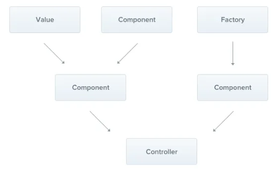

# Providers
Provider는 Nest의 핵심 개념임

- 서비스, 레포지토리, 팩토리 그리고 helper와 같은 기본 Nest 클래스의 대부분은 provider로 취급할 수 있음.
- **provider의 핵심 아이디어: 의존성으로 주입하여 객체들이 서로 다양한 관계를 형성할 수 있도록 하는 것**
- 이러한 객체들을 관리하는 책임은 주로 Nest 런타임 시스템에 의해 처리됨

<br>

  

<br>


## Services


간단한 CatsService를 만드는 것으로 시작해보자.

**이 서비스는 데이터 저장 및 검색을 처리하면 CatsController에서 사용됨. 애플리케이션 로직을 관리하는 역할 때문에 provider로 정의하기 이상적인 후보임**

`cats.service.ts`

```tsx
import { Injectable } from '@nestjs/common';
import { Cat } from './interfaces/cat.interface';

@Injectable()
export class CatsService {
  private readonly cats: Cat[] = [];

  create(cat: Cat) {
    this.cats.push(cat);
  }

  findAll(): Cat[] {
    return this.cats;
  }
}
```

<br>

우리의 CatsServcie는 하나의 속성과 두 개의 메서드가 있는 기본 클래스임.

⭐ 중요한 사항

- **`@Injectable()` 데코레이터임**
- **이 데코레이터는 클래스에 메타데이터를 첨부하여 `CatsService`가 Nest IoC 컨테이너에서 관리할 수 있는 클래스 임을 알림**

`interfaces/cat.interface.ts`

```tsx
export interface Cat {
  name: string;
  age: number;
  breed: string;
}
```

<br>

이제 고양이를 검색하는 서비스 클래스가 있으니 `CatsController` 내부에서 사용해보자.

`cats.controller.ts`

```tsx
import {
    Controller,
    Get,
    Post,
    Body,
} from "@nestjs/common";
import {CreateCatDto} from "./dto/create-cat.dto";
import {CatsService} from "./cats.service";
import {Cat} from "./interfaces/cat.interface";

@Controller("cats")
export class CatsController {
    constructor(private catsService: CatsService) {
    }

    @Post()
    async create(@Body() createCatDto: CreateCatDto) {
        this.catsService.create(createCatDto);
    }

    @Get()
    async findAll(): Promise<Cat[]> {
        return this.catsService.findAll();
    }
}
```

**→ CatsService는 클래스 생성자를 통해 주입됨**

→ `private` 키워드를 사용해 catsService 멤버를 선언하고 초기화할 수 있어 프로세스가 간소화됨


<br>

## 의존성 주입(Dependency Injection)


**Nest는 의존성 주입이라는 강력한 디자인 패턴을 기반으로 구축되어 있음**

TS의 기능 덕분에 의존성 관리하는 것이 간단함.

→ 의존성은 유형에 따라 해결되기 때문임.

<br>

아래 예는 Nest에서 CatsService 인스턴스를 생성하고 반환하여(또는 싱글톤의 경우 다른 곳에서 이미 요청된 경우 기존 인스턴스를 반환) catsService를 해결함.

그런 다음 이 의존성은 컨트롤러의 생성자에 주입이됨

```tsx
constructor(private catsService: CatsService) {}
```

<br>

## 생명주기(scope)


**provider는 일반적으로 애플리에이션 수명 주기와 일치함**

- 애플리케이션이 부트스트랩되면 각 종속성을 해결해야 하므로 모든 provider가 인스턴스화 됨.
- 마찬가지로 종료되면 모든 provider는 제거됨.
- 그러나 provider를 요청 범위로 만들 수 있음.  
  **→ provider의 수명은 애플리케이션의 수명 주가기 아닌 특정 요청에 연결 될 수 있음**

<br>

## Custom Providers


Nest에는 제공자 간의 관계를 관리하는 제어 역전 컨테이너가 함께 제공됨.

→ 이 기능은 의존성 주입의 기초이지만 실제로는 지금까지 다룬 것보다 좋음.

→ provider를 정의하는 방법은 여러가지가 있음. (일반 값, 클래스, 비동기 또는 동기 팩토리 모두 지원)

→ 이건 의존성 주입 장에서 더 배울것

<br>

## Provider 등록


CatsService와 CatsController를 정의했으므로 Nest에 서비스를 등록하여 주입을 처리할 수 있도록 해야 함.

`app.module.ts`

```tsx
import {Module}         from "@nestjs/common";
import {CatsController} from "./cats/cats.controller";
import {CatsService}    from "./cats/cats.service";

@Module({
    imports: [],
    controllers: [CatsController],
    **providers: [CatsService],**
})
export class AppModule {
}
```
