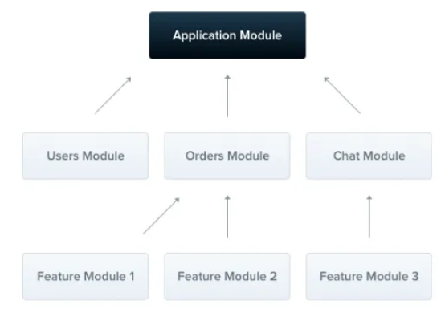
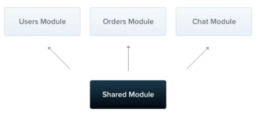

# Modules

**모듈은 `@Module()` 데코레이터로 주석이 달린 클래스임.**

**→ Nest가 애플케이션 구조를 효율적으로 구성하고 관리하는 데 사용하는 메타데이터를 제공함**



<br>

**모든 Nest 애플리케이션에는 최소한 하나의 모듈, 즉 루트 모듈이 있으며, 이는 Nest가 애플리케이션 그래프를 빌드하는 시작점 역할을 함**

- 이 그래프는 Nest가 모듈과 provider 간의 관계와 종속성을 해결하는 데 사용하는 내부 구조임.
- 소규모 애플리케이션에는 루트 모듈만 있을 수 있지만 일반적으로 그렇지 안흠.
- 모듈은 구성 요소를 구성하는 효과적인 방법으로 적극 권장됨.
- 대부분의 애플리케이션에는 밀접하게 관련된 기능 세트를 캡슐화하는 여러 모듈이 있을 가능성이 높음

<br>

**`providers`**

: nest의 injector에 의해 인스턴스화되고 최소한 이 모듈 전체에 공급될 수 있는 provider

**`controllers`**

: 이 모듈에서 정의된 컨트롤러 세트는 인스턴스화되어야 함

**`imports`**

: 이 모듈에 필요한 provider를 내보내는 가져온 모듈 목록

**`exports`**

: 이 모듈에서 제공하는 provider 하위 집합이며 이 모듈을 가져오는 다른 모듈에서 사용할 수 있어야 함. provider 자체를 사용하거나 토큰만 사용할 수 있음

<br>

모듈은 기본적으로 제공자를 캡슐화하므로 현재 모듈의 일부이거나 다른 가져온 모듈에서 명시적으로 내보낸 provider만 주입할 수 있음.

모듈에서 내보낸 provider는 본질적으로 모듈의 공개 인터페이스 또는 API 역할을 함

## Feature modules


CatsController와 CatsServcie는 밀접하게 관련되어 있음 → 동일한 애플리케이션 도메인을 제공함

- 이들을 기능 모듈로 그룹화하는 것은 합리적임
- 기능 모듈은 특정 기능과 관련된 코드를 구성하여 명확한 경계와 더 나은 구성을 유지하는 데 도움이 됨
- 이는 애플리케이션이나 팀이 성장함에 따라 특히 중요하며 SOLD 원칙과 일치함

<br>

컨트롤러와 서비스를 그룹화하는 방법을 보여줌

`cats.module.ts`

```tsx
import { Module } from '@nestjs/common';
import { CatsController } from './cats.controller';
import { CatsService } from './cats.service';

@Module({
  controllers: [CatsController],
  providers: [CatsService],
})
export class CatsModule {}
```

→ `cats.module.ts` 파일에 `CatsModule`을 정의하고 이 모듈과 관련된 모든 것을 cats 디렉토리로 옮김

<br>

마지막으로 해야 할 일은 이 모듈을 루트 모듈(`app.module.ts` 파일에 정의된 `AppModule`)로 가져오는 것

`app.module.ts`

```tsx
import { Module } from '@nestjs/common';
import { CatsModule } from './cats/cats.module';

@Module({
  imports: [CatsModule],
})
export class AppModule {}
```

## shared modules


**Nest에서 모듈은 기본적으로 싱글톤이므로 여러 모듈에서 모든 공급자의 동일한 인스턴스를 손쉽게 공유할 수 있음**




**모든 모듈은 자동으로 공유 모듈이 됨. 일단 만들어지면 모든 모듈에서 재사용할 수 있음.**

<br>

if. 다른 여러 모듈 간에 `CatsService` 인스턴스를 공유하고자 한다고 가정

→ 이를 위해서는 먼저 아래 그림과 같이 모듈의 내보내기 배열에 `CatsService` 공급자를 추가하여 내보내야 함

```tsx
import {Module}         from "@nestjs/common";
import {CatsController} from "./cats.controller";
import {CatsService}    from "./cats.service";

@Module({
    controllers: [CatsController],
    providers: [CatsService],
    exports: [CatsService],
})
export class CatsModule {
}
```

**→ 이를 import 하는 다른 모듈과 동일한 인스턴스를 공유할 수 있음**

<br>

`CatsModule`과 같은 모듈 내부에 `CatsService`를 캡슐화하여 내보내면 `CatsModule`을 가져오는 모든 모듈에서 동일한 `CatsService` 인스턴스가 재사용됨.

→ 메모리 소비가 줄어듬

→ 모든 모듈이 동일한 인스턴스를 공유하기 때문에 공유상태나 리소스를 더 쉽게 관리할 수 있음
