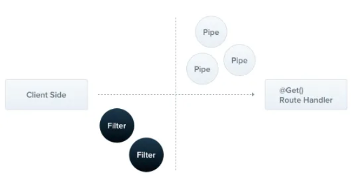

# Exception filters

**Nest에는 애플리케이션 전체에서 처리되지 않은 모든 예외를 처리하는 예외 계층이 내장되어 있음.**

**애플리케이션 코드에서 처리되지 않은 예외가 발생하면 이 계층에서 이를 포착하여 적절한 사용자 응답을 자동으로 전송함**



<br>

**기본적으로 이 작업은 내장된 전역 예외 필터에 의해 수행되며, 이 필터는 `HttpException` 유형의 예외를 처리함**

- 예외가 인식되지 않는 경우 기본 제공 예외 필터는 다음과  같이 기본 JSON 응답을 생성함

```tsx
{
  "statusCode": 500,
  "message": "Internal server error"
}
```
<br>

## Throwing standard exceptions


Nest는 `@nestjs/common` 패키지에서 기본 제공 `HttpException` 클래스를 제공함.

<br>

ex. `CatsContorller`에는 `findAll()` 메서드가 있음. 이 라우트 ㅎ내들러가 어떤 이유로 예외를 던진다고 가정해보자. 이를 위해 코딩한다면

```tsx
@Get()
async findAll(): Promise<Cat[]> {
     throw new HttpException("Forbidden", HttpStatus.FORBIDDEN);
}
```

<br>

다음과 같이 응답이 올 것

```tsx
{
  "statusCode": 403,
  "message": "Forbidden"
}
```

<br>

`HttpException` 생성자는 응답을 결정하는 두 개의 필수 인수를 받음

- 응답 인수는 JSON 응답 본문을 정의함. 문자열 또는 객체일 수 있음
- status 인수는 HTTP 상태 코드를 정의함

<br>

기본적으로 JSON 응답 본문에는 다음 두 가지 속성이 포함됨

- `statusCode`: 기본적으로 상태 인수에 제공도니 HTTP 상태 코드
- `message`: 상태에 따른 HTTP 오류에 대한 간단한 설명

<br>

## Custom exceptions


**대부분의 경우 사용자 정의 예외를 작성할 필요가 없으며, 다음 섹션에 설명된 대로 기본 제공 Nest HTTP 예외를 사용할 수 있음.**

<br>

사용자 정의 예외를 작성해야 하는 경우에는 사용자 정의 예외가 기본 `HttpException` 클래스에서 상속되는지 자체 예외 계층 구조를 만드는 것이 좋음.

→ 이 접근 방식을 사용하면 Nest가 예외를 인식하고 오류 응답을 자동으로 처리함

<br>

`forbidden.exception.ts`

```tsx
import {
    HttpException,
    HttpStatus,
} from "@nestjs/common";

export class ForbiddenException extends HttpException {
    constructor() {
        super("Forbidden", HttpStatus.FORBIDDEN);
    }
}
```

→ 이 예외는 기존에 만들어 봤던 예외와 동일하게 적용함

<br>

```tsx
    @Get()
    async findAll(): Promise<Cat[]> {
        throw new ForbiddenException();
    }
```

<br>

## Built-in HTTP exceptions


Nest는 기본 `HttpException`에서 상속되는 일련의 표준 예외를 제공함.

- `BadRequestException`
- `UnauthorizedException`
- `NotFoundException`
- `ForbiddenException`
- `NotAcceptableException`
- `RequestTimeoutException`
- `ConflictException`
- `GoneException`
- `HttpVersionNotSupportedException`
- `PayloadTooLargeException`
- `UnsupportedMediaTypeException`
- `UnprocessableEntityException`
- `InternalServerErrorException`
- `NotImplementedException`
- `ImATeapotException`
- `MethodNotAllowedException`
- `BadGatewayException`
- `ServiceUnavailableException`
- `GatewayTimeoutException`
- `PreconditionFailedException`

<br>

## Exception filters


기본 예외 필터가 많은 경우를 자동으로 처리할 수 있지만 예외 계층을 완전히 제어하고 싶을 수 있음

<br>

ex. 로깅을 추가, 일부 동적 용인에 따라 다른 JSON 스키마를 사용하고 싶을 수 있음

**→ 예외 필터는 이런 목적을 위해 설계됨**

**→ 예외 필터를 사용하면 정확한 제어 흐름과 클라이언트로 다시 전송되는 응답의 내용을 제어할 수 있음**

<br>

`HttpException` 클래스의 인스턴스인 예외를 포착하고 이에 대한 사용자 정의 응답 로직을 구현하는 예외 필터를 만들어보자

- 요청 객체에 액세스하여 원본 URL을 가져와 로깅 정보에 포함
- `Response` 객체를 사용하여 `response.json()` 메서드를 사용하여 전송된 응답을 직접 제어할 것

```tsx
import {
    ArgumentsHost,
    Catch,
    ExceptionFilter,
    HttpException,
} from "@nestjs/common";
import {
    Request,
    Response,
} from "express";

@Catch(HttpException)
export class HttpExceptionFilter implements ExceptionFilter {
    catch(exception: HttpException, host: ArgumentsHost) {
        const ctx = host.switchToHttp();
        const response = ctx.getResponse<Response>();
        const request = ctx.getRequest<Request>();
        const status = exception.getStatus();

        response
            .status(status)
            .json({
                statusCode: status,
                timestamp: new Date().toISOString(),
                path: request.url,
            });
    }

}
```

→ `Catch(HttpException)` 데코레이터는 필요한 메타데이터를 예외 필터에 바인딩하여 이 특정 필터가 `HttpException` 유형의 예외만 찾고 있음을 Nest에 알려줌.

<br>

## Binding filters


`HttpExceptionFilter`를 어떻게 사용하는지 보자

```tsx
@Post()
**@UseFilters(new HttpExceptionFilter())**
async create(@Body() createCatDto: CreateCatDto) {
  throw new ForbiddenException();
}
```

위 예제에서는 단일 create() 라우트 랜들러에만 적용되어 메소드 범위가 지정됨. 예외 필터는 컨트롤러/resolver/게이트웨이, 컨트롤러 범위 또는 전역 범위 등 다양한 수준에서 범위를 지정할 수 있음

ex. 컨트롤러 범위로 필터를 설정하려면 다음과 같이 해야함

```tsx
@Controller()
**@UseFilters(new HttpExceptionFilter())**
export class CatsController {}
```

→ CatsController 내부에 정의된 모든 경로 핸들러에 대해 HttpExceptionFilter를 설정함

<br>

전역 범위 필터 적용

`main.ts`

```tsx

async function bootstrap() {
  const app = await NestFactory.create(AppModule);
  **app.useGlobalFilters(new HttpExceptionFilter());**
  await app.listen(process.env.PORT ?? 3000);
}
bootstrap();
```
