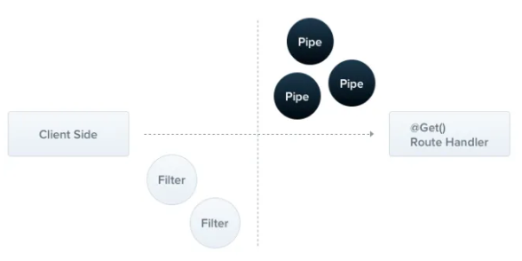

# Pipes
> **파이프는 `PipeTransform` 인터페이스를 구현하는 `@Injectable()` 데코레이터로 주석이 달린 클래스**
>




파이프는 두 가지 일반적인 사용 사례가 있음

1. **변환: 입력 데이터를 원하는 형태로 변환 (ex. 문자열 → 정수)**
2. **유효성 검사: 입력 데이터를 평가하여 유효하면 변경하지 않고 통과, 그렇지 않으면 예외**

<br>

두 경우 모두 파이프는 컨트롤러 라우트 핸들러가 처리 중인 인수를 대상으로 작동함.

**Nest는 메서드가 호출되기 직전에 파이프를 삽입하고, 파이프는 메서드의 대상이 되는 인수를 받아 이를 대상으로 작업함. 이때 모든 변환 또는 유효성 검사 작업이 수행되고, 그 후에 라우트 핸들러가 변환된 인수를 사용하여 호출함**

Nest에는 바로 사용할 수 있는 여러 가지 기본 제공 파이프가 있음. 또는 사용자가 정의해서 파이프를 직접 구축할 수도 있음.


<br>

## Built-in pipes


Nest의 즉시 사용가능한 파이프들

- `ValidationPipe`
- `ParseIntPipe`
- `ParseFloatPipe`
- `ParseBoolPipe`
- `ParseArrayPipe`
- `ParseUUIDPipe`
- `ParseEnumPipe`
- `DefaultValuePipe`
- `ParseFilePipe`
- `ParseDatePipe`

→ `@nestjs/common` 패키지에서 export를 함

<br>

## Binding pipes


파이프를 사용하려면 파이프 클래스의 인스턴스를 적절한 컨텍스트에 바인딩해야 함.

`ParseIntPipe` 예제에서는 파이프를 특정 라우트 핸들러 메서드와 연결하고 메서드가 호출되기 전에 파이프가 실행되도록 하려고 함.

<br>

```tsx
@Get(":id")
async findOne(@Param("id", **ParseIntPipe**) id: number) {
	return this.catsService.findOne(id);
}
```

→ `findOne()` 메서드에서 받은 매개변수가 숫자이거나 라우트 핸들러가 호출되기 전에 예외가 발생하는 두 가지 조건 중 하나가 참인지 확인할 수 있음

<br>

## Custom pipes


사용자 정의 파이프를 직접 만들 수 있음

<br>

Nest는 기본 제공 `ParseIntPipe` 및 `ValidationPipe`를 제공하지만, 사용자 정의 파이프가 어떻게 구서오디어 있는지 알아보기 위해 각각의 간단한 버전부터 만들어 보자


<br>

`ValidationPipe` 만들기

- 단순히 입력값을 받아 즉시 동일한 값을 반환하여 ID 함수처럼 동작하도록

```tsx
import {
    ArgumentMetadata,
    Injectable,
    PipeTransform,
} from "@nestjs/common";

@Injectable()
export class ValidationPipe implements PipeTransform {
    transform(value: any, metadata: ArgumentMetadata): any {
        return value;
    }
}
```

<br>

**모든 파이프는 `PipeTransform` 인터페이스를 위해 `transform()` 메서드를 구현해야 함**

두 개의 매개변수가 있음

1. `value` : 현재 처리된 메서드 인자(경로 처리 메서드에서 수신하기 전)
2. `metadata` : 현재 처리도니 메서드 인자의 메타데이터

<br>

메타데이터 객체에는 다음과 같은 속성이 있음

```tsx
export interface ArgumentMetadata {
  type: 'body' | 'query' | 'param' | 'custom';
  metatype?: Type<unknown>;
  data?: string;
}
```

- `type` : `@Body()`, query `@Query()`, `@Param()` 또는 사용자 지정 매개변수인지를 나타냄
- `metatype` : 인수의 메타타입을 제공함(ex. 문자열)
- `data` : 데코레이터에 전달된 문자열(ex. @Body(’문자열’)). 데코레이터 괄호를 비워두면 정의되지 않음

<br>

## Schema based validation

유효성 검사 파이프를 좀 더 유용하게 만들어 보자.

서비스 메서드를 실행하기 전에 Post 본문 객체가 유효한지 확인해야 하는 `CatsController`의 `create()` 메서드를 자세히 살펴보자

```tsx
@Post()
async create(@Body() createCatDto: CreateCatDto) {
	this.catsService.create(createCatDto);
}
```

```tsx
export class CreateCatDto {
    name: string;
    age: number;
    breed: string;
}
```

create 메서드로 들어오는 모든 요청에 유효한 본문이 포함되어 있는지 확인하고자 함.

따라서 createCatDto 객체의 새 맴버의 유효성 검사를 해야 함.

**→ 라우터 핸들러 메서드 내부에서 이 작업을 수행할 수 있지만 단일 책임 원칙(SRP)을 위반하기에 이상적이지 않음**


<br>

또 다른 접근 방식은 유효성 검사기 클래스를 생성하고 거기서 작업을 위임하는 것.

**→ 이 방법은 각 메서드의 시작부분에서 이 유효성 검사기를 호출하는 것을 기억해야하는 단점이 있음**

<br>

유효성 검사 미들웨어를 만드는 방법도 있음

**→ 이는 전체 애플리케이션의 모든 컨텍스트에서 사용할 수 있는 일반적인 미들웨어로 만드는 것은 불가능함**

→ 미들웨어는 호출될 핸들러와 그 매개변수 등 실행 컨텍스트를 인식하지 못하기 때문…

<br>

## Class validator


유효성 검사 기술에 대한 대체 구현을 보자

Nest 클래스 유효성 검사기 라이브러리와 잘 작동함.

- 이 라이브러리를 사용하면 데코레이터 기반 유효성 검사를 사용할 수 있음
- 데코레이터 기반 유효성 검사는 특히 처리된 프로퍼티의 메타타입에 액세스할 수 있기 때문에 Nest의 파이프 기능과 결합하면 매우 강력함

<br>

시작하기 전에 필요한 패키지를 설치해야 함

```tsx
$ npm i --save class-validator class-transformer
```

<br>

설치되면 `CreateCatDto` 클래스에 몇 가지 데코레이터를 추가할 수 있음

- 장점: 별도의 유효성 검사 클래스를 만들 필요 없이 `CreateCatDto` 클래스가 Post 본문 객체에 대한 단일 소스로 유지 된다는 점

```tsx
import {
    IsInt,
    IsString,
} from "class-validator";

export class CreateCatDto {
    **@IsString()**
    name: string;

    **@IsInt()**
    age: number;

    **@IsString()**
    breed: string;
}

```

<br>

이제 이러한 어노테이션을 사용하는 `ValidationPipe` 클래스를 만들 수 있음

```tsx
import {
    ArgumentMetadata,
    BadRequestException,
    Injectable,
    PipeTransform,
}                        from "@nestjs/common";
import {plainToInstance} from "class-transformer";
import {validate}        from "class-validator";

@Injectable()
export class ValidationPipe implements PipeTransform {
    async transform(value: any, {metatype}: ArgumentMetadata): Promise<any> {
        if (!metatype || !this.toValidate(metatype)) {
            return value;
        }

        const object = plainToInstance(metatype, value);
        const errors = await validate(object);
        if (errors.length > 0) {
            throw new BadRequestException("Validation failed");
        }
        return value;
    }

    private toValidate(metatype: Function): boolean {
        const types: Function[] = [String, Boolean, Number, Array, Object];
        return !types.includes(metatype);
    }
}
```

<br>

만든 ValidationPipe를 바인딩하는 것.

- 파이프는 매개변수 범위, 메서드 범위, 컨트롤러 범위 또는 전역 범위가 될 수 있음

`@Body()` 데코레이터에 바인딩하여 파이프가 호출되어 포스트 본문의 유효성을 검사

```tsx
@Post()
@UseFilters(new HttpExceptionFilter())
async create(@Body(**new ValidationPipe()**) createCatDto: CreateCatDto) {
	this.catsService.create(createCatDto);
}
```

<br>

## Global scoped pipes


```tsx
async function bootstrap() {
  const app = await NestFactory.create(AppModule);
  **app.useGlobalPipes(new ValidationPipe());**
  await app.listen(process.env.PORT ?? 3000);
}
bootstrap();
```

<br>

## Transformation use case


유효성 검사만이 사용자 정의 파이프의 유일한 사용 사례는 아님.

**→ 파이프로 입력 데이터를 원하는 형식으로 변환할 수 있다고 언급함**

→ transform 함수에서 반환된 값이 인수의 이전 값을 재정의하기 때문에 가능한 것

<br>

그럼 언제 유용할까?

→ 클라이언트에서 전달된 데이터가 라우트 핸들러 메서드에서 제대로 처리되기 전에 문자열을 정수로 반환하는 등 일부 변경을 거쳐야하는 겨우가 있음

→ 또한 일부 필수 데이터 필드가 누락되어 기본값을 적용하고자 할 수 있음

**→ 변환 파이프는 클라이언트 요청과 요청 핸들러 사이에 처리 함수를 삽입하여 이러한 기능을 수행할 수 있음**

<br>

다음은 문자열을 정수 값으로 구문 분석하는 간단한 `ParseIntPipe` 예시

```tsx
import {
    ArgumentMetadata,
    BadRequestException,
    Injectable,
    PipeTransform,
} from "@nestjs/common";

@Injectable()
export class ParseIntPipe implements PipeTransform<string, number> {
    transform(value: string, metadata: ArgumentMetadata): number {
        const val = parseInt(value, 10);
        if (isNaN(val)) {
            throw new BadRequestException("Validation failed");
        }

        return val;
    }
}
```
