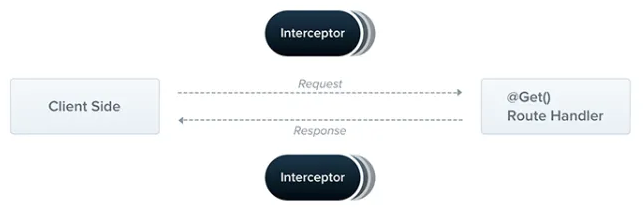

# Interceptors

> **인터셉터는 `@Injectable()` 데코레이터로 주석이 달린 클래스이면 `NestInterceptor` 인터페이스를 구현함**
>




인터셉터는 객체지향 프로그래밍(AOP) 기법에서 영감을 얻은 유용한 기능들이 있음

- **매서드 실행 전후에 추가 로직 바인딩**
- **함수에서 반환된 결과 변환**
- **함수에서 던져진 예외 변환**
- **기본 함수 동작 확장**
- **특정 조건에 따라 함수 완전히 재정의**

<br>

## Basic


각 인터셉터는 `intercept()` 메서드를 구현하는데, 이 메서드는 두 개의 인수를 받음

- `guard`
- `ExecutionContext`
    - `ArgumentsHost`에서 상속함. 원래 핸들러에 전달된 인수를 감싸는 래퍼이며 애플리케이션 유형에 따라 다른 인수 배열을 포함한다는 것을 봄.

<br>

## Aspect interception


첫 번째 사용 사례는 인터셉터를 사용하여 사용자 상호 작용을 기록하는 것.

<br>

간단한 `LogginInterceptor`를 보여줌

`logging.interceptor.ts`

```tsx
import {
    CallHandler,
    ExecutionContext,
    Injectable,
    NestInterceptor,
} from "@nestjs/common";
import {
    Observable,
    tap,
} from "rxjs";

@Injectable()
export class LoggingInterceptor implements NestInterceptor {
    intercept(context: ExecutionContext, next: CallHandler<any>): Observable<any> {
        console.log("Before...");

        const now = Date.now();
        return next
            .handle()
            .pipe(
                tap(() => console.log(`After... ${Date.now() - now}ms`)),
            );
    }
}
```

<br>

## Binding interceptors

인터셉터를 설정하기 위해 `@nestjs/common` 패키지에서 가져온 `@UseInterceptors()` 데코레이터를 사용함.

- 파이프 및 가드와 마찬가지로 인터셉터도 컨트롤러 범위, 메서드 범위 또는 전역 범위로 설정할 수 있음

<br>

`cats.controller.ts`

```tsx
**@UseInterceptors(LoggingInterceptor)**
export class CatsController {}
```

<br>

글로벌 인터셉터를 설정하기 위해 Nest 애플리케이션 인스턴스의 `useGlobalInterceptors()` 메서드를 사용함

```tsx
const app = await NestFactory.create(AppModule);
**app.useGlobalInterceptors(new LoggingInterceptor());**
```

<br>

## Response mapping

우리는 이미 `handle()`가 `Observable`을 반환한다는 것을 알고 있음.

스트림에는 라우트 핸들러에서 반환된 값이 포함되어 있으므로 RxJS의 `map()` 연산자를 사용하여 쉽게 변경할 수 있음

<br>

프로세스를 보여주기 위해 각 응답을 간단한 방식으로 수정하는 TransfromInterceptor를 만들어 봄.

- 이 함수는 RxJS의 `map()` 연산자를 사용하여 응답 객체를 새로 생성된 객체의 데이터 속성에 할당하고 새객체를 클라이언트로 반환함

```tsx
import {
    CallHandler,
    ExecutionContext,
    Injectable,
    NestInterceptor,
} from "@nestjs/common";
import {
    map,
    Observable,
} from "rxjs";

export interface Response<T> {
    data: T,
}

@Injectable()
export class TransformInterceptor<T> implements NestInterceptor<T, Response<T>> {
    intercept(context: ExecutionContext, next: CallHandler): Observable<Response<T>> {
        return next.handle().pipe(map(data => ({data})));

    }
}

```

<br>

위의 구조를 사용하면 다음과 같은 응답이 표시됨.

```tsx
{
  "data": []
}
```

<br>

**인터셉터는 전체 애플리케이션에서 발생하는 요구사항에 대해 재사용 가능한 솔루션을 만드는데 큰 가치가 있음.**

ex. `null` 값이 발생할 때마다 빈문자열 ‘’ 로 반환해야 한다고 가정

한 줄의 코드를 사용하여 이를 수행하고 인터셉터를 전역적으로 바인딩하여 등록된 각 핸들러에서 자동으로 사용하도록 할 수 있음

```tsx
import {
    CallHandler,
    ExecutionContext,
    Injectable,
    NestInterceptor,
}                   from "@nestjs/common";
import {
    map,
    Observable,
} from "rxjs";

@Injectable()
export class ExcludeNullInterceptor implements NestInterceptor {
    intercept(context: ExecutionContext, next: CallHandler<any>): Observable<any> {
        return next
            .handle()
            .pipe(map(value => value === null ? "" : value));
    }
}
```

<br>

## Exception mapping

또 다른 사례는 RxJS의 `catchError()` 연산자를 활용하여 던져진 예외를 재정의하는 것

```tsx
import {
    BadGatewayException,
    CallHandler,
    ExecutionContext,
    Injectable,
    NestInterceptor,
} from "@nestjs/common";
import {
    catchError,
    Observable,
    throwError,
} from "rxjs";

@Injectable()
export class ErrorInterceptor implements NestInterceptor {
    intercept(context: ExecutionContext, next: CallHandler<any>): Observable<any> {
        return next
            .handle()
            .pipe(
                catchError(err => throwError(() => new BadGatewayException())),
            );
    }
}
```

<br>

## Stream overriding


처리기 호출을 완전히 방지하고 대신 다른 값을 반환하는 데에는 몇 가지 이유가 있음

- 대표적인 예가 응답 시간을 개선하기 위해 캐시를 구현하는 것

<br>

**캐시에서 응답을 반환하는 간단한 캐시 인터셉터를 보자**

- TTL, 캐시 무효화, 캐시 크기 등과 같은 다른 요소도 고려해야 하지만 여기서는 이 논의의 범위를 벗어남
- 여기서는 주요 개념을 설명하는 기본 예제를 제공

<br>

`cach.interceptor.ts`

```tsx
import {
    CallHandler,
    ExecutionContext,
    Injectable,
    NestInterceptor,
} from "@nestjs/common";
import {
    Observable,
    of,
} from "rxjs";

@Injectable()
export class CacheInterceptor implements NestInterceptor {
    intercept(context: ExecutionContext, next: CallHandler<any>): Observable<any> {
        const isCached = true;
        if (isCached) {
            return of([]);
        }
        return next.handle();
    }
}
```

<br>

캐시 인터셉터는 하드코딩된 isCached 변수와 하드코딩된 응답 []도 있음

🚨 주목할 사항

- RxJS의 () 연산자에 의해 생성된 새스트림을 반환하므로 라우트 핸들러가 전혀 호출되지 않는다는 것
- **누군가 `CacheInterceptor`를 사용하는 엔드포인트를 호출하면 응답이 즉시 반환**
- 일반적인 솔루션을 만들려면 리플렉터를 활용하고 사용자 정의 데코레이터를 만들 수 있음.
    - 리플렉터는 가드에 나와 있음

<br>

## More operators


RxJS 연산자를 사용하여 스트림을 조작할 수 있기 때문에 많은 기능을 사용할 수 있음

<br>

또 다른 일반적인 사용 사례를 보자

**ex. 경로 요청에 대한 시간 초과를 처리하고 싶다고 가정**

- 일정 시간이 지나도 엔드포인트에서 아무것도 반환하지 않으면 오류 응답으로 종료하고 싶을 것

`timeout.interceptors.ts`

```tsx
import {
    CallHandler,
    ExecutionContext,
    Injectable,
    NestInterceptor,
    RequestTimeoutException,
} from "@nestjs/common";
import {
    catchError,
    Observable,
    throwError,
    timeout,
} from "rxjs";

@Injectable()
export class TimeoutInterceptor implements NestInterceptor {
    intercept(context: ExecutionContext, next: CallHandler<any>): Observable<any> {
        return next
            .handle()
            .pipe(
                timeout(5000),
                catchError(err => {
                    if (err instanceof TimeoutInterceptor) {
                        return throwError(() => new RequestTimeoutException());
                    }
                    return throwError(() => err);
                }),
            );
    }
}
```
