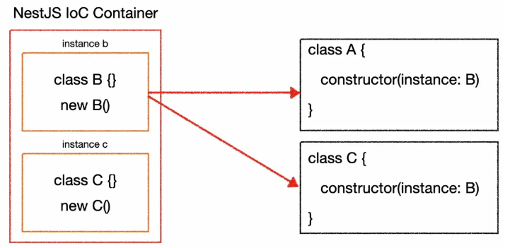

## 의존성 주입 & 제어의 역전

<br>

### 일반 인스턴스화
```tsx
class A {
	const b = B();
}

------------------------------

class B {
}
```

**→ A라는 클래스를 만들 때 마다 B라는 클래스 인스턴스를 계속 만들어 냄.**

<br>

## Dependency Injection

---

하지만 **의존성 주입**(Dependency Injection)을 사용하면

```tsx
class A {
	constructor(instance: B)
}

------------------------------

class B {
}
```

→ 클래스 B를 어디에서 생성을 한 후에 A의 `constructor`에다가 입력을 해줌. ⇒ 이를 **주입**이라고 함

→ 클래스 A를 생성할 때 클래스 B가 필요하기 때문에 ⇒ 클래스 A는 클래스 B에 **의존**하고 있다고 함.

**→ 따라서 의존하고 있는 값을 주입해준다라고 말할 수 있음**

<br>

### Inversion of Control


역제어가 된다는 말인데…

→ 원래는 클래스 A와 클래스 C가 클래스 B에 의존성이 있다고하면, **클래스 B를 어디선가 직접 생성해서 주입을 해줌**

**→ 이 클래스 B의 생성과정을 생성하고, 삭제하고, 주입을 해주는 과정을 프레임워크가 해준다!!!**

ex. 컨트롤러를 만들면 자동으로 서비스 부분이 생성한 적이 없는데 자동으로 주입이된 것을 볼 수 있었음

<br>

### Inversion of Control and Dependency Injection




NestJS는 실행과 동시에 IoC 컨테이너가 생성이됨.

- 이 안에 클래스 A와 클래스 C를 만들고, 이 안에 클래스 B를 사용을 해야 하는 상황임
- **이를 보고 IoC 컨테이너가 이를 보고 클래스 B를 생성을 함. 그리고 이 IoC 컨테이너가 클래스 B 인스턴스를 그대로 들고 있음. 이 인스턴스 B의 라이프사이클을 알아서 관리를 함.**
- 이제 클래스 A가 B가 필요하다고 하면 IoC 컨테이너가 알아서 주입을 해 주는 것
- 따라서 사용자는 이를 관리할 필요가 없는 것.

<br>

**위에서 언급했듯이 컨트롤러 constructor 안의 service 부분이 이에 해당을 함. 이를 service라고 불렀지만 이렇게 주입을 받을 수 있는 클래스들을 프로바이더(Provider)라고 함**

→ IoC 컨테이너가 알아서 프로바이더를 찾아서 알아서 주입을 해준다고 보면 됨.

<br>

## Inversion of Control 코드로 이해하기


```tsx
@Controller('posts')
export class PostsController {
  constructor(private readonly postsService: PostsService) {}
  ...
```

→ postsServcie를 주입하지 않았음. 그럼 도대체 어디서 넣어준거야??…

**→ 이건 NestJS IoC Container에서 해주고 있음**

<br>

그럼 이걸 어떻게 IoC 컨테이너가 인지를 할 수 있을까?

→ `*.module.ts` 에 있음

```tsx
import { Module } from '@nestjs/common';
import { PostsService } from './posts.service';
import { PostsController } from './posts.controller';

@Module({
  controllers: [PostsController],
  providers: [PostsService],
})
export class PostsModule {}
```

2개의 파라미터가 보임

- `controllers`: 컨트롤러를 등록
- `providers`: `PostController`에 주입을 해야하는 값을 넣어줌
    - service라는 명칭은 어떤 역할을 하는지에 대한 역할임
    - **typeorm, …, etc 가 있는데 이것도 주입을 받아야하는 경우가 생기는데, 그 클래스들이 여기에 들어간다고 보면 됨**

→ 코드에서 보면 클래스들이 인스턴스로 되어있지 않음(()가 없다는 말임). **그냥 인스턴스화 할 클래스만 등록**이되어 있는데, 이는 IoC Container가 관리를 하기위해서임.

<br>

**다음과 같이 `@Injectable()` 데코레이터가 있으면 provider로 사용할 수 있음**

```tsx
@Injectable()
```

<br>

따라서 프로바이더로 사용하기 위해서는

1. **`*.module.ts`의 provider에 등록하기**
2. **`@Injectable` 데코레이터 사용하기**

→ 이렇게 되면 IoC 컨테이너가 같은 모듈안의 어떤 곳에서 사용할 수 있게 해 줌.

**그렇다면 NestJS는 어떻게 모듈들을 어디서 찾아와서 어떤 모듈들을 NestJS안에서 관리해야하는 것을 알고 있을까?**

→ 우리가 NestJS를 처음 생성할 때는 `app.module.ts` 가 생김

```tsx
import { Module } from '@nestjs/common';
import { AppController } from './app.controller';
import { AppService } from './app.service';
import { PostsModule } from './posts/posts.module';

@Module({
  **imports: [PostsModule],**
  controllers: [AppController],
  providers: [AppService],
})
export class AppModule {}
```

- **위 코드를 보면 `imports`라는 것이 생김 → 다른 모듈을 불러올 때 등록함**

<br>

그럼 AppModule이 존재한다는 것은 NestJS에서 어떻게 알까?

→ `main.ts`를 보면 됨

```tsx
import { NestFactory } from '@nestjs/core';
import { AppModule } from './app.module';

async function bootstrap() {
  **const app = await NestFactory.create(AppModule);** 
  await app.listen(3000); // 3000번 포트에서 앱을 실행할 수 있음
}
bootstrap();
```

→ app이라는 걸 생성할때 `AppModule`을 넣어준 것을 볼 수 있음
