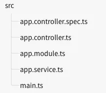

# First steps
Nest의 핵심 기본 사항에 대해 알아보자.

- Nest 애플리케이션의 필수 구성 요소에 익숙해지기 위해 입문 수준에서 많은 부분을 다루는 기능을 갖춘 기본 CRUD 애플리케이션을 만들어 보겠습니다.

<br>


## 언어


Nest는 TS및 수순 JS에 모두 호환됨.

<br>


## 필수 구성 요소


Node.js 버전이 20. 이상이 있는지 확인하시오.

## 설정


Nest CLI를 사용하여 간단하게 프로젝트를 시작할 수 있음.

npm이 설치되어 있으면 OS 터미널에서 다음 명령을 사용하여 새 Nest 프로젝트를 만들 수 있음.

```bash
$ npm i -g @nestjs/cli
$ nest new project-name
```

<br>


프로젝트 이름 디렉토리가 생성되고, 노드 모듈과 몇 가지 다른 상용구 파일이 설치되며, src/ 디렉토리가 생성되어 몇 가지 핵심 파일로 채워집니다.



<br>


핵심 파일에 대한 간단한 설명

| `app.controller.ts` | 단일 경로를 갖춘 기본 컨틀로러 |
| --- | --- |
| `app.controller.spec.ts` | 컨틀롤러에 대한 단위 테스트 |
| `app.module.ts` | 애플리케이션의 루트 모듈 |
| `app.service.ts` | 단일 방법을 제공하는 기본 서비스 |
| `main.ts` | Nest 애플리케이션 인스턴스를 생성하기 위해 핵심 함수 `NestFactory`를 사용하는 애플리케이션의 엔트리 파일입니다. |

<br>

main.ts에는 애플리케이션을 부트스트랩하는 비동기 함수가 포함되어 있음

```tsx
import {NestFactory} from "@nestjs/core";
import {AppModule}   from "./app.module";

async function bootstrap() {
    const app = await NestFactory.create(AppModule);
    await app.listen(3000);
}

bootstrap();
```

→ Nest에서는 애플리케이션 인스턴스를 생성하기위해 **NestFactory 클래스**를 사용함.

NestFactory 클래스는 애플리케이션 인스턴스를 생성할 수 있는 정적 메서드가 있음.

- create() 메서드는 애플리케이션 객체를 반환하며, 이 객체는 INestApplication 인터페이스를 구현함.
- 이 객체는 다음 장에서 설명하는 일련의 메서드를 제공.
- 위의 main.ts 예제에서는 애플리케이션이 인바운드 HTTP 요청을 기다릴 수 있도록 HTTP 수신기를 시작하기만 하면 됨.

<br>


## 플랫폼


**Nest는 기본적으로 Express와 Fastify라는 두 가지 HTTP 플랫폼이 지원함. 필요에 가장 적합한 것을 선택할 수 있음.**

<br>


아래 예시처럼 `NestFactory.create()` 메서드에 유형을 전달하면 앱 객체는 해당 특정 플랫폼에서만 사용할 수 있는 메서드가 있음.

하지만 실제로 기본 유형의 플랫폼 API에 액세스 하려면 설정하지 않아도 됨

```tsx
const app = await NestFactory.create<NestExpressApplication>(AppModule);
```

<br>


## 애플리케이션 실행


```tsx
$ npm run start
```

→ 파일에 정의된 포트에서 HTTP 서버가 수신 대기하는 앱을 시작함.

http://localhost:3000/ 에 Hellow World!가 뜨면 성공

<br>


파일의 변경 사항을 감시하려면 다음 명령을 실행하여 애플리케이션을 시작함

```tsx
$ npm run start:dev
```

**→ 이 명령은 파일을 감시하고, 서버를 자동으로 다시 컴파일하고 다시 로드함**
