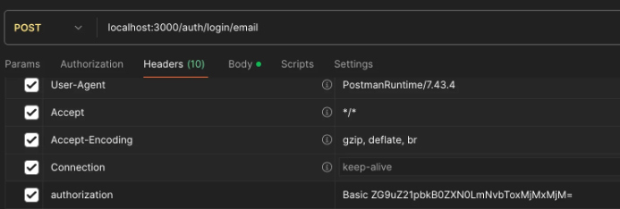

# Docker
## Docker Introduction




NestJS로 프로젝트를 만들고 나면 여러 컴퓨터에서 사용해야하는 상황이 발생함 → 결국 이렇게 됨!

<br>

🚨 문제상황

- **누군가 다 만든 프로젝트를 보내주면 다른 사람이 이를 다른 컴퓨터에서는 실행이 안됨…**

왜 이런 문제가 나올까?

→ Multi Platform 때문임 → 환경이 다 다르다는 뜻… → 문제의 근원

<br>

🚨 또 다른 문제

- **처리해야할 작업들이 너무 많음**
    - nodeJS 설치
    - pnpm 설치
    - nestJS CLI 설치
    - …

<br>

⭐ 해결방법

**도커 파일을 만듬**

: 설치 가이드들을 순서대로 절차만 따라서 실행만하면 이 프로젝트가 무조건 실행이 된다라는 파일

<br>

**위 파일을 만들고 도커에서 실행하면 → 무조건 실행이 됨**

- 운영체제에 관계 없이 항상 똑같은 환경에서 실행할 수 있다는 뜻

<br>

## 대략적인 도커


→ OS위에 Docker Engine이 있음. 이는 Docker 엔지니어들이 알아서 처리를 해줌

→ 우리는 그냥 도커 파일을 사용해서 Docker Engine에다가 놓으면 끝

따라서 도커 파일 작성만 할 줄 알면 자유롭게 배포할 수 있음

<br>

## Docker Compose Introduction


나중에는 위 그림처럼 도커 컨테이너들이 이렇게 많이 만들어질 수 있음… → 관리하기가 어려워짐.

<br>

⭐ 해결 방법

**위의 문제점을 해결하기위해서 나온 것이 쿠버네티스, 도커 컴포즈, 도커 스웜 같은 기술임**


<br>

단점

- **docker compose 만의 문법이 있음**

<br>

## Docker Compose 파일 작성하기


### 도커 설치 확인하기

```tsx
docker --version
```

버전이 나오면 설치 완료

<br>

### 컨테이너 이미지 가져오기

[Docker Hub Container Image Library | App Containerization](https://hub.docker.com/)


<br>

인증된 도커 이미지만 들고오는 것이 좋음

그리고 쓸 이미지를 기억하기

- ex. postgres 15(버전임)

<br>

### `docker-compose.yaml` 파일 만들기

컨테이너들에 대한 정보를 입력함.

- yaml은 tab의 개수를 잘 넣어야 함.

```yaml
services:
	# postgres라는 것은 이미지 이름이 아니라 우리가 지어주는 이름임.
  postgres: 
	  # 어떤 이미지를 쓸지를 적어주면 됨. 버전은 : 뒤에 붙이면됨.
    image: postgres:15 
    
    # 실행을 할 때마다 재시작을 해라
    restart: always 
    
    # 도커 이미지안의 파일들이 그대로 유지할 수 있는 것
    volumes: 
    
	    # 이 폴더와 postgres 이미지 안에 있는 폴더를 연동시켜줌
      - ./postgres-data:/var/lib/postgresql/data 
      # 콜론을 기준으로 왼쪽은 우리 폴더 위치 / 오른쪽은 도커 이미지 안에 존재하는 위치
    
    # 이미지 상의 포트와 우리 host의 포트를 매핑시켜줌  
    ports: 
    
	    # -> 호스트의 5432 포트와 이미지 속의 5432 포트를 연동시키는 것
      - "5432:5432" 
      
    # 데이터베이스의 정보를 넣어줄 수 있음
    environment: 
      POSTGRES_USER: postgres # 이미지를 띄웠을 때 기본 사용자 이름
      POSTGRES_PASSWORD: postgres
      POSTGRES_DB: postgres

```

→ `services`: 어떤 정보를 정의할 지


<br>

### 도커 실행하기

```yaml
docker-compose up
```
