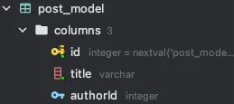

# TypeORM

## Typeorm 설치하기


```java
pnpm i @nestjs/typeorm typeorm pg
```

<br>

## Typeorm 등록하기

`app.module.ts`

```typescript
import { Module } from '@nestjs/common';
import { AppController } from './app.controller';
import { AppService } from './app.service';
import { TypeOrmModule } from '@nestjs/typeorm';
import { UserModel } from './entity/user.entity';

@Module({
  imports: [
    TypeOrmModule.forFeature([UserModel]),
    **TypeOrmModule.forRoot({
      type: 'postgres',
      host: '127.0.0.1',
      port: 15432,
      username: 'postgres',
      password: 'postgres',
      database: 'typeormstudy',
      entities: [UserModel],
      synchronize: true,
    }),**
  ],
  controllers: [AppController],
  providers: [AppService],
})
export class AppModule {}

```

**→ `app.module.ts`에서는 `TypeOrmModule.forRoot()` 부분만 작성**

**→ `TypeOrmModule.forFeature()` 부분은 등록된 레포지토리를 사용할 `module`에 작성**

**그리고 해당 레포지토리를 사용하기 위해서는 `servcie.ts` 부분에 `constructor`에 등록을 해줘야 함**

```tsx
@Injectable()
export class PostsService {
  constructor(
    // 레포지토리를 쓰기 위해 데코레이터를 하나 추가해야 함
    **@InjectRepository(PostsModel)
    private readonly postsRepository: Repository<PostsModel>,**
  ) {}
  ...
```

<br>

## Column Annotion

`user.entity.ts`

```typescript
import {
  Column,
  CreateDateColumn,
  Entity,
  Generated,
  PrimaryColumn,
  PrimaryGeneratedColumn,
  UpdateDateColumn,
  VersionColumn,
} from 'typeorm';
import { Version } from '@nestjs/common';

@Entity()
export class UserModel {
  // 자동으로 아이디를 생성함
  //@PrimaryGeneratedColumn()

  // 모든 테이블에서 기본적으로 존재해야함
  // 테이블 안에서 각각의 ROW를 구분 할 수 있는 칼럼
  // 자동생성이 아니라서 개발자가 직접 값을 넣어야 함
  //@PrimaryColumn()

  //@PrimaryGeneratedColumn() -> 순서대로 값이 올라감
  //@PrimaryGeneratedColumn('uuid') -> asdfa-asdf-asdfasdf-1232asdfad-213123

  @PrimaryGeneratedColumn()
  id: number;

  @Column()
  title: string;

  // 데이터가 생성되는 날짜의 시간이 자동으로 찍힘
  @CreateDateColumn()
  createdAt: Date;

  // 업데이트 되는 날짜의 시간이 자동으로 찍힘
  @UpdateDateColumn()
  updatedAt: Date;

  // 데이터가 업데이트 될 때마다 1씩 올라감
  // 처음 생성되면 1임
  // save() 함수가 몇 번 불렀는지 기억함.
  @VersionColumn()
  version: number;

  @Column()
  @Generated('uuid')
  additionalId: string;
}
```

### `@Entity`

**: 엔티티로 사용한다고 등록을 함**

<br>

### `@Column()`

**: 컬럼을 등록함**

<br>

### `@PrimaryGeneratedColumn()`

**: 자동으로 아이디를 생성함**

<br>

- **`@PrimaryGeneratedColumn(’uuid’)`: 아이디를 자동으로 uuid로 되게끔 해줌**

<br>

### `@PrimaryColumn()`

**: 그냥 기본키 설정 → 개발자가 직접 값을 넣어서 생성해줘야함.**

<br>

### `@CreatedDateColumn()`

**: 데이터가 생성되는 날짝의 시간이 자동으로 찍힘**

<br>

### `@UpdateDateColumn()`

**: 업데이트 되는 날짜의 시간이 자동으로 찍힘**

<br>

### `@VersionColumn()`

**: 데이터가 업데이트 될 때마다 1씩 올라감.**

- 처음 생성되면 1임.
- `save()` 함수의 호출 수라고 보면 됨

<br>

## Column Property

```typescript
import {
  Column,
} from 'typeorm';
import { Version } from '@nestjs/common';

@Entity()
export class UserModel {
  @Column({
    // 데이터베이스에서 인지하는 컬럼 타입
    // 자동으로 유추됨
    type: 'varchar',

    //데이터베이스 컬럼 이름
    // 프로퍼티 이름으로 자동 유추됨
    name: 'title',

    // 값의 길이
    // 입력할 수 있는 글자의 길이
    length: 300,

    // null이 가능한지
    nullable: true,

    // true이면 처음 저장할 때만 값지정 가능
    // 이후에는 값 변경 불가능 -> 업데이트를 못하게 한다는 말
    update: true,

    // find()를 실행할 때 기본으로 값을 불러올지
    // 기본값이 true, 만약 false를 하고 가져오고 싶으면 find부분에서 select를 해야 함
    select: true,

    // 기본값
    // 아무것도 생성 안했을 때 뜨는 값
    default: 'default value',

    // 컬럼중에서 유일무이한 값이 돼야하는지
    unique: false,
  })
  title: string;
}
```

- **`type`: 데이터베이스에서 인지하는 컬럼 타입.**
    - 자동으로 유추됨
- **`name`: 데이터베이스 컬럼 이름.**
    - 없으면 프로퍼티 이름으로 자동 유추됨.
- **`length`: 값의 길이.**
    - 입력할 수 있는 글자의 길이
- **`nullable`: null이 가능한지**
- **`update`: true이면 처음 저장할 때만 값지정 가능.**
    - 이후에는 값 변경 불가 → 업데이트를 못한다는 말
- **`select`: find()를 실행할 때 기본으로 값을 불러올지.**
    - 기본값이 true
    - 만약 false를 하고 가져오고 싶으면 find 부분에서 select를 진행해야 함
- **`default`: 기본값**
    - 아무것도 생성 안했을 때 지정한 값이 생성됨
- **`unique`: 컬럼 중에서 유일무이한 값이 도어야하는지**

<br>

## Enum Column

```tsx
import {
  Column,
  CreateDateColumn,
  Entity,
  Generated,
  PrimaryColumn,
  PrimaryGeneratedColumn,
  UpdateDateColumn,
  VersionColumn,
} from 'typeorm';
import { Version } from '@nestjs/common';

**export enum Role {
  USER = 'user',
  ADMIN = 'admin',
}**

@Entity()
export class UserModel {
	...
  **@Column({
    type: 'enum',
    enum: Role,
    default: Role.USER,
  })
  role: Role;**
  ...
}
```

다음과 같이 Role이라는 enum을 만들고, Entity에서 사용할 때 다음과 같이 사용을 함.

- `type: ‘enum’`
    - 타입은 enum 타입이다.
- `enum: Role`
    - 이넘의 타입은 Role이다
- `default: Role.USER`
    - 기본값은 Role enum의 USER다.
    

<br>

## Entity Embeding

```tsx
@Entity()
export class StudentModel {
  @PrimaryGeneratedColumn()
  id: number;

  @Column()
  firstName: string;

  @Column()
  lastName: string;

  @Column()
  class: string;
}

@Entity()
export class TeacherModel {
  @PrimaryGeneratedColumn()
  id: number;

  @Column()
  firstName: string;

  @Column()
  lastName: string;

  @Column()
  salary: string;
}
```

위 코드의 두 엔티티를 보면 중복되는 컬럼이 있음

→ id, fistName, lastName

<br>


**이 중복을 줄여주는 것이 Entity Embeding이라고 보면 됨**

사용방법

```tsx
export class Name {
  @Column()
  first: string;

  @Column()
  last: string;
}
```

**→ 중복되는걸 `@Entity()` 라는 데코레이터 없이 클래스를 만들어줌**

<br>


그 후

```tsx
@Entity()
export class StudentModel {
  @PrimaryGeneratedColumn()
  id: number;

  **@Column(() => Name)
  name: Name;**

  @Column()
  class: string;
}

@Entity()
export class TeacherModel {
  @PrimaryGeneratedColumn()
  id: number;

  **@Column(() => Name)
  name: Name;**

  @Column()
  salary: string;
}
```

다음과 같이 작성을해줌

그러면 실제 데이터베이스는 다음과 같이 들어가게 됨

<p float="left">
  
  
</p>

<br>

## Table Inheritance

테이블을 상속하는 방법은 2가지가 있음

1. **테이블 두 개를 만들어서 관리하기**

```tsx
export class BaseModel {
  // 엔티티 데코레이터가 없어서 테이블이 생성되지 않음
  @PrimaryGeneratedColumn()
  id: number;

  @CreateDateColumn()
  createdAt: Date;

  @UpdateDateColumn()
  updatedAt: Date;
}

@Entity()
export class BookModel extends BaseModel {
  @Column()
  name: string;
}

@Entity()
export class CarModel extends BaseModel {
  @Column()
  brand: string;
}
```

`BaseModel`의 테이블의 내용을 각각 `BookModel`, `CarModel`이 상속받게 한 후 필요한 내용만 넣어서 결과를 본다면

<p float="left">
  
  
</p>

**→ 다음과 같이 정의를 하지 않아도 상속을 통해 `BaseModel`의 내용을 가져오는 것을 볼 수 있음**

<br>

1. **테이블 한 개로 통합해서 관리하기**

```tsx
@Entity()
**@TableInheritance({
  column: {
    name: 'type',
    type: 'varchar',
  },
})**
export class SingleBaseModel {
  @PrimaryGeneratedColumn()
  id: number;

  @CreateDateColumn()
  createdAt: Date;

  @UpdateDateColumn()
  updatedAt: Date;
}

@ChildEntity()
export class ComputerModel extends SingleBaseModel {
  @Column()
  brand: string;
}

@ChildEntity()
export class AirplaneModel extends SingleBaseModel {
  @Column()
  country: string;
}
```

다음과 같이 설정을 한다면

→ `name`은 타입이라고 생성

→ 그 `name`의 타입은 `varchar`로 하겠다라는 의미


`SingleBaseModel`에서 하위의 두 개 `ComputerModel`, `AirplaneModel`을 관리할 수 있음

- country와 brand가 varchar인 것을 볼 수 있음.

<br>

## One to One Relationship

1 : 1 관계에 대해서 어떻게 typeorm을 사용하는지 알아보자

일단 2개의 엔티티를 만듬

```tsx
import {
  Column,
  Entity,
  JoinColumn,
  OneToOne,
  PrimaryGeneratedColumn,
} from 'typeorm';
import { UserModel } from './user.entity';

@Entity()
export class ProfileModel {
  @PrimaryGeneratedColumn()
  id: number;

  **// 1:1 관게 설정
  // 첫 번째 매개변수는 어떤 엔티티와 관계를 맺을 것인가
  // 두 번째 매개변수는 그 엔티티 테이블에 어떤 속성으로 맺을 것인가
  @OneToOne(() => UserModel, (user) => user.id)
  // JoinColumn()을 해줘야하는데 이 데코레이터가 있는 곳에서 관련 id가 생김
  // ex. 지금은 ProfileModel에 했는데 이러면 UserModel의 참조 아이디가 이 테이블에 생성된다는 뜻
  @JoinColumn()
  user: UserModel;**

  @Column()
  profileImg: string;
}

```

1:1 관계를 만들기 위해 다음과 같이 작성을 함

- **`@OneToOne(() => UserModel, (user) => user.id)`**
    - 1:1 관계를 설정하겠다.
    - 첫 번째 매개변수: 어느 엔티티와의 관계를 맺을 것인가
    - 두 번째 매개변수: 그 엔티티 테이블에 어떤 속성과 관계를 맺을지 설정
- **`@JoinColumn()`**
    - 1:1 관계를 설정해 주기위해서는 다음을 꼭 작성을 해줘야함.
    - 이 데코레이터가 있는 곳에서 관계에 있는 엔티티의 id가 생김
    - 지금은 PorifleModel에 했는데 이러면 UserModel의 참조 아이디가 이 엔티티 테이블에 생성된다는 뜻

<br>

```tsx
import {
  Column,
  CreateDateColumn,
  Entity,
  Generated,
  OneToOne,
  PrimaryColumn,
  PrimaryGeneratedColumn,
  UpdateDateColumn,
  VersionColumn,
} from 'typeorm';
import { Version } from '@nestjs/common';
import { ProfileModel } from './profile.entity';

export enum Role {
  USER = 'user',
  ADMIN = 'admin',
}

@Entity()
export class UserModel {
  ...
  @PrimaryGeneratedColumn()
  id: number;

  @Column()
  email: string;
  ...
  @**OneToOne(() => ProfileModel, (profile) => profile.user)
  profile: ProfileModel;**
}

```

그래서 결과물을 보면


다음과 같이 userId가 생긴 것을 볼 수 있음.

<br>

그리고 1:1 관계설정을 해줬으니 find() 메서드에서 내용을 가져올 수 이씀

```tsx
  @Get('users')
  getUsers() {
    return this.userRepository.find({
      relations: {
        profile: true,
      },
    });
  }
```

→ 다음 코드에서 find의 속성으로 relations에 관계를 맺은 테이블을 true해주면 관계를 맺은 테이블의 내용까지 다 나오는 것을 볼 수 있음

<br>


false로 지정한 경우


<br>


true로 지정한 경우


<br>

## Many to One & One to Many Relationship 구현하기

**1:N 관계를 설명함**

```tsx
import { Column, Entity, ManyToOne, PrimaryGeneratedColumn } from 'typeorm';
import { UserModel } from './user.entity';

@Entity()
export class PostModel {
  @PrimaryGeneratedColumn()
  id: number;

  // 1:n 관계에서는 복수명사를 사용하는 것이 일반적
  // ManyToOne인 입장인사람이 id 값을 가짐
  **@ManyToOne(() => UserModel, (user) => user.posts)
  author: UserModel;**

  @Column()
  title: string;
}

```
<br>

위 코드에서는 1:N중에서 N쪽인 테이블을 볼 수 있음

- **`@ManyToOne(() => UserModel, (user) => user.posts)`**
    - `UserModel`과 1:N 관계를 맺는 것을 볼 수 있음.
    - 1:1과는 다르게 **복수명사**를 사용한 것을 볼 수 있음. `user.posts`
    - ManyToOne()인 입장에서 관계를 맺는 테이블의 id를 가진다고 보면 됨

<br>

1:N 에서 1인 쪽 테이블을 보면

```tsx
@Entity()
export class UserModel {
  ...
  **@OneToMany(() => PostModel, (post) => post.author)
  posts: PostModel[];**
}
```

- **`@OneToMany(() => PostModel, (post) => post.author)`**
    - PostModel과 관계를 맺고 있는 것을 볼 수 있음.
    - 1쪽에서는 **단수 명사**를 사용함
    - 타입을 보면 `[]` 인것을 볼 수 있음

<br>

## Many to Many Relationship 구현하기

**N:M 관계에 대해서 설명함**

```tsx
import { Column, Entity, ManyToMany, PrimaryGeneratedColumn } from 'typeorm';
import { PostModel } from './post.entity';

@Entity()
export class TagModel {
  @PrimaryGeneratedColumn()
  id: number;

  **@ManyToMany(() => PostModel, (post) => post.tags)
  posts: PostModel[];**

  @Column()
  name: string;
}
```

- **`@ManyToMany(() => PostModel, (post) => post.tags)`**
    - 다대다 이기 때문에 복수형인 것을 볼 수 있음
    - 그리고 엔티티를 배열로 들고 옴

<br>

```tsx
import {
  Column,
  Entity,
  JoinTable,
  ManyToMany,
  ManyToOne,
  PrimaryGeneratedColumn,
} from 'typeorm';
import { UserModel } from './user.entity';
import { TagModel } from './tag.entity';

@Entity()
export class PostModel {
  ...

  **@ManyToMany(() => TagModel, (tag) => tag.posts)
  @JoinTable()
  tags: TagModel[];**

  @Column()
  title: string;
}
```

관계를 맺는 테이블은 다음과 같이 작성함

- **`@ManyToMany(() => TagModel, (tag) => tag.posts)`**
    - **위와 똑같음**
- **`@JoinTable()`**
    - 이 데코레이터는 둘 중 아무 엔티티에 붙여도 상관이 없음

<br>

다대다는 다른 관계와는 다르게 새로운 테이블을 하나 생성해줌.

<p float="left">
  
  
</p>

→ `PostModel`과 `TageMode`은 다대다 관계인데 각각의 테이블에는 아무런 변화가 없음

<br>

**하지만 새로운 테이블이 하나 만들어 짐**


<br>

## FindManyOptions 파라미터 알아보기

```tsx
getUsers() {
    return this.userRepository.find({
      // 어떤 프로퍼티를 선택할지
      // 기본은 모든 프로퍼티를 가져옴
      // 만약 select를 정의하지 않으면
      // select를 정의하면 정의된 프로퍼티들만 가져옴
      select: {
        id: true,
        createdAt: true,
        updatedAt: true,
        version: true,
        profile: {
          id: true,
        },
      },

      // 필터링할 조건을 입력하게 된다.
      // and 조건으로 묶임, or 조건 하려면 []로 들고와야 함
      where: {
        profile: {
          id: 3,
        },
      },

      // 관계를 가져오는 법
      // 이를 추가하면 select, where에서 쓸 수 있음.
      relations: {
        profile: true,
      },

      // 오름차순 / 내림차순
      // asc / desc
      order: {
        id: 'ASC',
      },

      // 처음 몇 개를 제외할지,
      // 정렬하고 몇 개를 제외할지...
      skip: 0,

      // 몇 개를 가지고 올지
      take: 0,
    });
  }
```

- **`select`**
    - 어떤 프로퍼티를 선택할지
    - 기본은 모든 프로퍼티임
    - 만약 select를 정의하지 않으면 다 가져옴 select를 정의하면 정의도니 프로퍼티들만 가져옴
- **`where`**
    - 필터링할 조건을 입력하게 됨
    - and 조건으로 묶이게 되고 or 조건을 쓰려면 [{},{}] 이런식으로 써야 함
- **`relations`**
    - 관계를 가져오는 법
    - 이를 추가하면 select, where에서 쓸 수 있음
- **`order`**
    - 오름차순 / 내림차순 설정
    - ASC / DESC
- **`skip`**
    - 처음 몇 개를 제외할지 설정
    - 정렬하고 몇 개를 제외할지…
- **`take`**
    - 몇 개를 가지고 올 지 설저

<br>

## Typeorm 유틸리티 탐구

```tsx
@Get('users')
  getUsers() {
    return this.userRepository.find({
      // 필터링할 조건을 입력하게 된다.
      // and 조건으로 묶임, or 조건 하려면 []로 들고와야 함
      **where: {**
        // 아닌 경우 가져오기
        // id: Not(1),

        // 적은 경우 가져오기
        // id: LessThan(30),

        // 적은 경우 or 같은 경우
        // id: LessThanOrEqual(30),

        // 많은 경우 가져오기
        // id: MoreThan(30),

        // 같거나 많은 경우
        // id: MoreThanOrEqual(30),

        // 같은 값가져오기
        // id: Equal(30),

        // 유사값 가져오기
        // email: Like('%naver%'),

        // 대소문자 구분 안하는 유사값 가져오기
        // email: ILike('%NAVER%'),

        // 사이값
        // id: Between(10, 15),

        // 해당되는 여러 개의 ㄱ밧
        // id: In([1, 3, 5, 7, 99]),

        // ID가 Null인 경우 가져오기
        id: IsNull(),
      },

     ...
  }
```

<br>

## 흔히 사용되는 메서드

```tsx
@Post('sample')
  async sample() {
    // 모델에 해당되는 객체 생성 - DB에 저장은 안함
     const user1 = this.userRepository.create({
       email: 'test@naver.com',
     });

    // 모델에 해당하는 객체 생성 및 DB 저장
     const user2 = this.userRepository.save({
       email: 'test@naver.com',
     });

    // preload
    // 입력된 값을 기반으로 데이터베이스에 있는 데이터를 불러오고
    // 추가로 입력된 값으로 데이터베이스에 가져온 값들을 대체함
    // 저장하지 않음 (find함수와 create함수가 섞인 것)
     const user3 = await this.userRepository.preload({
       id: 101,
       email: '123@naver.cooom',
     });

    // 삭제하기
     await this.userRepository.delete({
       id: 101,
     });

    // 조건에 해당되는 모든 row에세 count 값을 증가 시키겠다
     await this.userRepository.increment(
       {
         id: 304,
       },
       'count',
       2,
     );

    // 값을 감소시킴
     await this.userRepository.decrement(
       {
         id: 304,
       },
       'count',
       2,
     );

    // 갯수 카운팅하기
     const count = await this.userRepository.count({
       where: {
         email: ILike('%0%'),
       },
     });

    // sum
     const sum = await this.userRepository.sum('count', {
       email: ILike('%0%'),
     });

    // average
     const average = await this.userRepository.average('count', {
       id: LessThan(4),
     });

    // 최솟값
     const min = await this.userRepository.minimum('count', {
       id: LessThan(4),
     });

    // 최대값
     const max = await this.userRepository.maximum('count', {
       id: LessThan(4),
     });

    // 찾기
     const users = await this.userRepository.find({});

    // 단 하나의 사용자
     const userOne = await this.userRepository.findOne({
       where: {
         id: 3,
       },
     });

    // 값들을 찾고 몇 개의 값만 들고 와라
    const usersAndCount = await this.userRepository.findAndCount({
      take: 3,
    });

    return true;
  }
```
