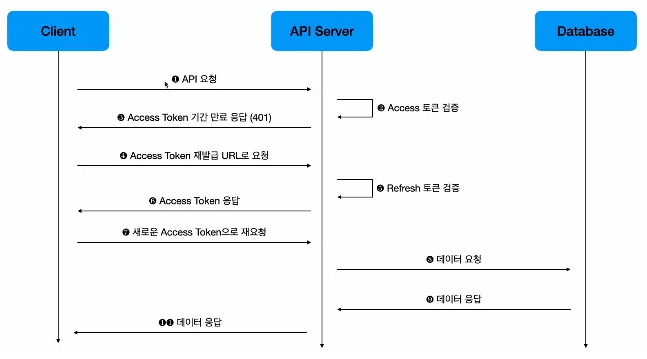
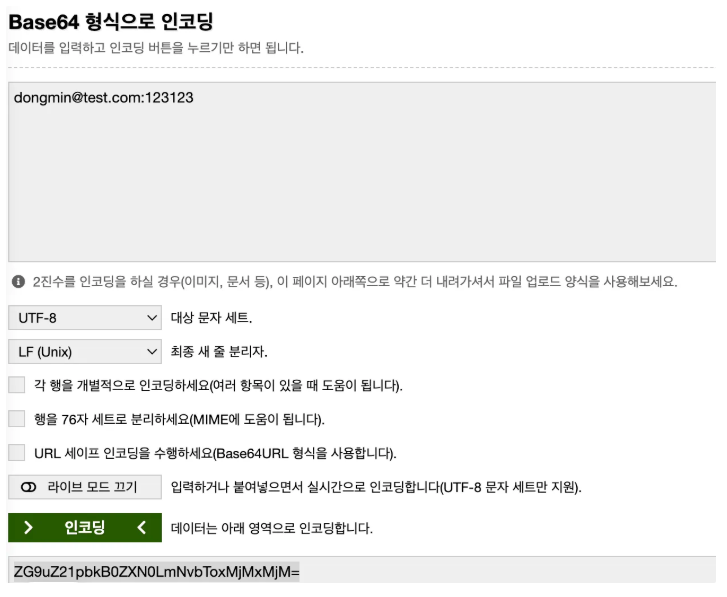

## JWT 설치하기
다음과 같은 명령어로 JWT를 사용하기 위해서 라이브러리를 설치함

```tsx
pnpm add @nestjs/jwt bcrypt
```

<br>

그리고 JWT를 사용하기 위해 auth 폴더를 생성함

```tsx
nest g resource auth
```

<br>

그리고 auth.module.ts에 JWT를 사용하기 위해서 import를 해줘야 함.

`auth.moudle.ts`

```tsx
import { Module } from '@nestjs/common';
import { AuthService } from './auth.service';
import { AuthController } from './auth.controller';
import { JwtModule } from '@nestjs/jwt';

@Module({
  **imports: [JwtModule.register({})],**
  controllers: [AuthController],
  providers: [AuthService],
})
export class AuthModule {}
```

<br>

## 요구사항 정하기

NestJS에서 사용하는 JWT를 내의 방식대로 풀어서 사용을 해봄 기본적인 로직 흐름은 다음과 같음



만드려는 기능에 차이는 있지만 나는 다음과 같은 기능에 따라서 JWT를 생성함

1. `registerWithEmail`
- email, nickname, password를 입력하고 사용자를 생성한다.
- 생성이 완료되면 accessToken과 refreshToken을 반환한다.
    - 회원가입 후 다시 로그인해주세요 <- 이런 쓸데없는 과정을 방지하기 위해

2. `loginWithEmail`
- email, password를 입력하면 사용자 검증을 진행한다.
- 검증이 완료되면 accessToken과 refreshToken을 반환한다.

3. `loginUser`
- (1)과 (2)에서 필요한 accessToken과 refreshToken을 반환하는 로직

4. `signToken`
- (3)에서 필요한 accessToken과 refreshToken을 sign하는 로직

5. `authenticateWithEmailAndPassword`
- (2)에서 로그인을 진행할 때 필요한 기본적인 검증 진행
    - 1. 사용자가 존재하는지 확인(email)
    - 2. 비밀번호가 맞는지 확인
    - 3. 모두 통과되면 찾은 사용자 정보 반환
    - 4. `loginWithEmail`에서 반환된 데이터를 기반으로 토큰 생성

<br>

### 1. AccessToken과 RefreshToken 생성하는 함수 만들기

`signToken`

```tsx
  signToken(user: Pick<UsersModel, 'email' | 'id'>, isRefreshToken: boolean) {
    const payload = {
      email: user.email,
      sub: user.id,
      type: isRefreshToken ? 'refresh' : 'access',
    };

    return this.jwtService.sign(payload, {
      secret: JWT_SECRET,
      // seconds
      expiresIn: isRefreshToken ? 3600 : 300,
    });
  }
```

→ type을 둬서 토큰이 refresh 토큰인지, access 토큰인지 판단을 함.

→ 만약 refresh 토큰일 경우 만료 시간을 3600초로 / access 토큰일 경우 만료 시간을 300초로 함

<br>

### 2. accessToken과 refreshToken을 반환해주는 함수 만들기

`loginUser`

```tsx
 async loginUser(user: Pick<UsersModel, 'email' | 'id'>) {
    return {
      accessToken: this.signToken(user, false),
      refreshToken: this.signToken(user, true),
    };
  }
```

→ `singToken`함수의 boolean 값에 따라서 토큰을 만들어주기 때문에 다음과 같이 작성함

<br>

### 3. 로그인 진행시 사용자가 있는지에 대한 함수 만들기


`authenticateWithEmailAndPassword`

```tsx
 async authenticateWithEmailAndPassword(
    user: Pick<UsersModel, 'email' | 'password'>,
  ) {
    const existingUser = await this.usersService.getUserByEmail(user.email);

    if (!existingUser) {
      throw new UnauthorizedException('존재하지 않는 사용자입니다.');
    }

    /*
     * bcrypt 사용법 - 파라미터
     *
     * 1) 입력된 비밀번호
     * 2) 기존 해시(hash) -> 사용자 정보에 저장돼있는 hash
     * */
    const passOk = await bcrypt.compare(user.password, existingUser.password);
    if (!passOk) {
      throw new UnauthorizedException('비밀번호가 틀렸습다.');
    }
    return existingUser;
  }
```

→ 여기서는 인증과 관련된 절차만 있으면 됨. 그래서 `users.service.ts`에서 `getUserByEmail`이라는 이메일에서 사용자를 반환해주는 함수를 만들어서 여기서 주입을 해서 사용하면 됨

→ bcrypt를 사용하여 입력한 비밀번호와 암호화된 비밀번호를 비교함

<br>

`users.servcie.ts`

```tsx
 async getUserByEmail(email: string) {
    return this.usersRepository.findOne({
      where: {
        email,
      },
    });
  }
```
<br>

### 4. 이메일로 로그인하는 함수 만들기

`loginWithEmail`

```tsx
async loginWithEmail(user: Pick<UsersModel, 'email' | 'password'>) {
    const existingUser = await this.authenticateWithEmailAndPassword(user);

    return this.loginUser(existingUser);
  }
```

<br>

### 5. 이메일로 회원가입하는 함수 만들기

`registerWithEmail`

```tsx
async registerWithEmail(
    user: Pick<UsersModel, 'nickname' | 'email' | 'password'>,
  ) {
    const hash = await bcrypt.hash(user.password, HASH_ROUNDS);

    const newUser = await this.usersService.createUser(user);

    return this.loginUser(newUser);
  }
```

→ 회원가입하고, 유저를 만드는 로직은 `users.service.ts`에서 진행함

<br>

`users.service.ts`

```tsx
async createUser(user: Pick<UsersModel, 'nickname' | 'email' | 'password'>) {
    // 1) nickname 중복이 없는지 확인
    // exist() -> 만약에 조건에 해당되는 값이 있으면 true
    const nicknameExists = await this.usersRepository.exists({
      where: {
        nickname: user.nickname,
      },
    });

    if (nicknameExists) {
      throw new BadRequestException('이미 존재하는 nickname 입니다!');
    }

    const emailExists = await this.usersRepository.exists({
      where: {
        email: user.email,
      },
    });

    if (emailExists) {
      throw new BadRequestException('이미 존재하는 email 입니다!');
    }

    const userObject = this.usersRepository.create({
      nickname: user.nickname,
      email: user.email,
      password: user.password,
    });
```

이렇게 만들고 controller에가서 해당 요청을 만들어서 보내면 토큰들이 잘 오는 것을 볼 수 있음

<br>

`auth.contorller.ts`

```tsx
import { Body, Controller, Post } from '@nestjs/common';
import { AuthService } from './auth.service';

@Controller('auth')
export class AuthController {
  constructor(private readonly authService: AuthService) {}

  @Post('login/email')
  loginEmail(@Body('email') email: string, @Body('password') password: string) {
    return this.authService.loginWithEmail({
      email,
      password,
    });
  }

  @Post('register/email')
  registerEmail(
    @Body('email') email: string,
    @Body('password') password: string,
    @Body('nickname') nickname: string,
  ) {
    return this.authService.registerWithEmail({
      nickname,
      email,
      password,
    });
  }
}
```

이제 토큰을 만들었으니. 토큰을 사용하는 방식을 알아야함

<br>

## 토큰을 사용하는 방식

만든 토큰을 이제 사용하는 방식에 대해 알아보자

1. 사용자가 로그인 또는 회원가입을 진행하면 `accessToken`과 `refreshToken`을 발급받음
2. 로그인할 때 Basic 토큰과 함께 요청을 보냄. Basic 토큰은 ‘`이메일: 비밀번호`’를 Base64로 인코딩한 형태임
    1. ex) `{authorization: 'Basic {token}'}`
3. 아무나 접근할 수 없는 정보(private route)를 접근할 때는 `accessToken`을 Header에 추가해서 요청과 함께 보냄
    1. ex) `ex) {authorization: 'Bearer {token}'}`
4. 토큰과 요청을 함께 받은 서버는 토큰 검증을 통해 현재 요청을 보낸 사용자가 누구인지 알 수 있음
    1. ex) 현재 로그인한 사용자가 작성한 포스트만 가져오려면 토큰의 sub 값에 입력돼있는 사용자의 포스트만 따로 필터링 할 수 있음. 특정 사용자의 토큰이 없다면 다른 사용자의 데이터를 접근 못함
5. 모든 토큰은 만료 기간이 있음. 만료 기간이 지나면 새로 토큰을 발급받아야 함. 그렇지 않으면 jwtService.verify()에서 인징이 통과 안됨. 그러니 `accessToken`을 새로 발급받을 수 있는 /auth/token/access와 `refreshToken`을 새로 발급받을 수 있는 /auth/token/refresh가 필요함
6. 토큰이 만료되면 각각의 토큰을 새로 발급 받을 수 있는 엔드포인트에 요청을 해서 새로운 토큰을 발급받고 새로운 토큰을 사용해서 private route에 접근함

<br>

### 1. Header의 토큰이 Basic인지 Bearer인지 확인하는 함수 만들기

---

`auth.service.ts`

```tsx
async extractTokenFromHeader(header: string, isBearer: boolean) {
    const splitToken = header.split(' ');
    const prefix = isBearer ? 'Bearer' : 'Basic';

    if (splitToken.length !== 2 || splitToken[0] !== prefix) {
      throw new UnauthorizedException('잘못된 토큰입니다!');
    }

    const token = splitToken[1];

    return token;
  }
```

Header에서 토큰이 올 때 `{authorization: 'Basic {token}'}` 또는 `{authorization: 'Bearer {token}'}` 과 같이 옴.

<br>
따라서 splitToken이라는 변수를 만들어서 헤더의 내용을 기준으로 빈 공백으로 분리를 하면 각각 이렇게 나올 것

- `[Basic, {toekn}]`
- `[Bearer, {token}]`

<br>
그래서 토큰만 추출해 주기 위해서 배열을 두 번째 원소를 추출해서 return을 해주는 함수임.

<br>

하지만 토큰이 있는지 없는지와 Basic인지 Bearer인지 확인하기 위해서 if문을 구성했다고 보면 됨

- 토큰의 문자열 길이가 2가 아니거나
- splitToken의 첫 번째 원소가 Basic 또는 Bearer가 아닌 경우

→ Error을 일으킴

<br>

### 2. Login시에 Basic 토큰에서 인코딩된 email과 password 추출하는 함수


로그인시에는 헤더에 `email: password` 가 Base64로 인코딩되어서 예를 들면 `Basic asd’fasdfasdf’asdf` 이런식으로 전달이됨.

<br>

이렇게 인코딩된 헤더에서 email과 password를 추출하려면 디코드를 해줘야함. 이제 이걸 함수로 만들면

`auth.service.ts`

```tsx
  decodeBasicToken(base64String: string) {
    const decoded = Buffer.from(base64String, 'base64').toString('utf-8');

    const split = decoded.split(':');
    if (split.length !== 2) {
      throw new UnauthorizedException('잘못된 유형의 토큰입니다.');
    }

    const email = split[0];
    const password = split[1];
    return {
      email,
      password,
    };
  }
```

→ 우선 base64를 들고옴

→ Node에서 제공해주는 `Buffer.from()` 함수를 통해서 base64로 디코딩을 해주고 이를 string 값으로 바꿔줌.

→ 그 후 `:` 를 기준으로 분리를 하면 `{email: email, password: password}` 이런식으로 나옴

→ 이제 로그인 로직에 맞게 객체로 감싸서 return 함

<br>

`auth.controller.ts`

```tsx
import { Body, Controller, Post, Headers } from '@nestjs/common';
import { AuthService } from './auth.service';

@Controller('auth')
export class AuthController {
  constructor(private readonly authService: AuthService) {}

  @Post('login/email')
  loginEmail(**@Headers('authorization') rawToken: string**) {
    // email:password -> Base64로 인코딩되어 있음
    const token = this.authService.extractTokenFromHeader(rawToken, false);

    const credentials = this.authService.decodeBasicToken(token);

    return this.authService.loginWithEmail(credentials);
  }
  ...
```

→ controller에서는 로그인 요청을 할 때 Headers에 있는 authorization 값을 들고 옴

→ 그럼 email:password가 Base64로 이코딩되어 있는 것을 볼 수 있음

→ 여기서 `extractTokenFromHeader()`를 통해서 token을 가져오고

→ `decodeBasicToken()`에서 email과 pasword를 뽑아와서 `loginWithEamil()`로 로그인을 시키는 흐름

<br>

예시 dongmin@test.com:123123 → email:password 형태로 Base64로 인코딩을 함



그럼 다음과 같은 값이 나옴 `ZG9uZ21pbkB0ZXN0LmNvbToxMjMxMjM=`

이를 이제 요청을 보내는 헤더에 다음 그림과 같이 넣고 사용하면 로그인이 됨. 만약 token값이 틀리면 로그인 진행하지 못함.


<br>

### 3. JWT 토큰이 유효한 토큰인지 검증하는 함수 만들기

`auth.service.ts`

```tsx
  verifyToken(token: string) {
    return this.jwtService.verify(token, {
      secret: JWT_SECRET,
    });
  }
```

→ jwtService에서 지원하는 함수를 사용하여 token이 유효한지 판단함.

<br>

### 4. refresh 토큰 재발급해주는 함수 만들기

---

`auth.service.ts`

```tsx
rotateToken(token: string, isRefreshToken: boolean) {
    const decoded = this.jwtService.verify(token, {
      secret: JWT_SECRET,
    });

    /*
     * payload 안에
     * sub: id
     * email: email,
     * type: 'access' | 'refresh'
     * */
    if (decoded.type !== 'refresh') {
      throw new UnauthorizedException(
        '토큰 재발급은 Refresh 토큰으로만 가능합니다.',
      );
    }

    return this.signToken(
      {
        ...decoded,
      },
      isRefreshToken,
    );
  }
  
  
   signToken(user: Pick<UsersModel, 'email' | 'id'>, isRefreshToken: boolean) {
    const payload = {
      email: user.email,
      sub: user.id,
      type: isRefreshToken ? 'refresh' : 'access',
    };

    return this.jwtService.sign(payload, {
      secret: JWT_SECRET,
      // seconds
      expiresIn: isRefreshToken ? 3600 : 300,
    });
  }
```

→ `decoded` 변수에서 JWT 값이 맞다면 payload에 접근을 할 수 있음

→ 우리가 payload 안에 type을 정해놨기에 여기서 type이 refresh가 아닌 경우 에러를 발생시킴

→ refresh 토큰이라면 singToken 함수를 통해, payload와 isRefreshToken 값을 보내줌

<br>

decoded의 값

```tsx
{
  email: 'dongmin@test.com',
  sub: 2,
  type: 'refresh',
  iat: 1747376127,
  exp: 1747379727
}

```

→ 여기에 email 값과 id 값이 들어있기 때문에 signToken 함수와 쓸 수 있는 거 같음.

<br>

따라서 rotateToken 함수를 조금 수정해 본다면 다음과 같이 적는 것이 타입의 안정성이 조금 더 올라가지 않을까

```tsx
 rotateToken(token: string, isRefreshToken: boolean) {
    const decoded = this.jwtService.verify(token, {
      secret: JWT_SECRET,
    });

    if (decoded.type !== 'refresh') {
      throw new UnauthorizedException(
        '토큰 재발급은 Refresh 토큰으로만 가능합니다.',
      );
    }

    return this.signToken(
      {
        **email: decoded.email,
        id: decoded.sub,**
      },
      isRefreshToken,
    );
  }
```

<br>

## JWT 관련 전체 코드


`auth.module.ts`

```tsx
import { Module } from '@nestjs/common';
import { AuthService } from './auth.service';
import { AuthController } from './auth.controller';
import { JwtModule } from '@nestjs/jwt';
import { UsersModule } from '../users/users.module';

@Module({
  imports: [JwtModule.register({}), UsersModule],
  controllers: [AuthController],
  providers: [AuthService],
})
export class AuthModule {}

```

<br>

`auth.controller.ts`

```tsx
import { Body, Controller, Post, Headers } from '@nestjs/common';
import { AuthService } from './auth.service';

@Controller('auth')
export class AuthController {
  constructor(private readonly authService: AuthService) {}

  @Post('token/access')
  postTokenAccess(@Headers('authorization') rawToken: string) {
    const token = this.authService.extractTokenFromHeader(rawToken, true);

    const newToken = this.authService.rotateToken(token, false);

    return {
      accessToken: newToken,
    };
  }

  @Post('token/refresh')
  postTokenRefresh(@Headers('authorization') rawToken: string) {
    const token = this.authService.extractTokenFromHeader(rawToken, true);

    const newToken = this.authService.rotateToken(token, true);

    return {
      refreshToken: newToken,
    };
  }

  @Post('login/email')
  postLoginEmail(@Headers('authorization') rawToken: string) {
    const token = this.authService.extractTokenFromHeader(rawToken, false);

    const credentials = this.authService.decodeBasicToken(token);

    return this.authService.loginWithEmail(credentials);
  }

  @Post('register/email')
  postRegisterEmail(
    @Body('email') email: string,
    @Body('password') password: string,
    @Body('nickname') nickname: string,
  ) {
    return this.authService.registerWithEmail({
      nickname,
      email,
      password,
    });
  }
}
```

<br>

`auth.service.ts`

```tsx
import {
  BadRequestException,
  Injectable,
  UnauthorizedException,
} from '@nestjs/common';
import { JwtService } from '@nestjs/jwt';
import { UsersModel } from '../users/entities/users.entity';
import { HASH_ROUNDS, JWT_SECRET } from './const/auth.const';
import { UsersService } from '../users/users.service';
import * as bcrypt from 'bcrypt';

@Injectable()
export class AuthService {
  constructor(
    private readonly jwtService: JwtService,
    private readonly usersService: UsersService,
  ) {}
  
  extractTokenFromHeader(header: string, isBearer: boolean) {
    const splitToken = header.split(' ');
    const prefix = isBearer ? 'Bearer' : 'Basic';

    if (splitToken.length !== 2 || splitToken[0] !== prefix) {
      throw new UnauthorizedException('잘못된 토큰입니다!');
    }

    const token = splitToken[1];

    return token;
  }

  decodeBasicToken(base64String: string) {
    const decoded = Buffer.from(base64String, 'base64').toString('utf-8');
    const split = decoded.split(':');
    if (split.length !== 2) {
      throw new UnauthorizedException('잘못된 유형의 토큰입니다.');
    }

    const email = split[0];
    const password = split[1];
    return {
      email,
      password,
    };
  }

  verifyToken(token: string) {
    return this.jwtService.verify(token, {
      secret: JWT_SECRET,
    });
  }

  rotateToken(token: string, isRefreshToken: boolean) {
    const decoded = this.jwtService.verify(token, {
      secret: JWT_SECRET,
    });

    if (decoded.type !== 'refresh') {
      throw new UnauthorizedException(
        '토큰 재발급은 Refresh 토큰으로만 가능합니다.',
      );
    }

    return this.signToken(
      {
        ...decoded,
      },
      isRefreshToken,
    );
  }

  signToken(user: Pick<UsersModel, 'email' | 'id'>, isRefreshToken: boolean) {
    const payload = {
      email: user.email,
      sub: user.id,
      type: isRefreshToken ? 'refresh' : 'access',
    };

    return this.jwtService.sign(payload, {
      secret: JWT_SECRET,
      // seconds
      expiresIn: isRefreshToken ? 3600 : 300,
    });
  }

  loginUser(user: Pick<UsersModel, 'email' | 'id'>) {
    return {
      accessToken: this.signToken(user, false),
      refreshToken: this.signToken(user, true),
    };
  }

  async authenticateWithEmailAndPassword(
    user: Pick<UsersModel, 'email' | 'password'>,
  ) {
    const existingUser = await this.usersService.getUserByEmail(user.email);

    if (!existingUser) {
      throw new UnauthorizedException('존재하지 않는 사용자입니다.');
    }

    const passOk = await bcrypt.compare(user.password, existingUser.password);
    if (!passOk) {
      throw new UnauthorizedException('비밀번호가 틀렸습다.');
    }
    return existingUser;
  }

  async loginWithEmail(user: Pick<UsersModel, 'email' | 'password'>) {
    const existingUser = await this.authenticateWithEmailAndPassword(user);

    return this.loginUser(existingUser);
  }

  async registerWithEmail(
    user: Pick<UsersModel, 'nickname' | 'email' | 'password'>,
  ) {
    const hash = await bcrypt.hash(user.password, HASH_ROUNDS);

    const newUser = await this.usersService.createUser({
      ...user,
      password: hash,
    });

    return this.loginUser(newUser);
  }
}

```
